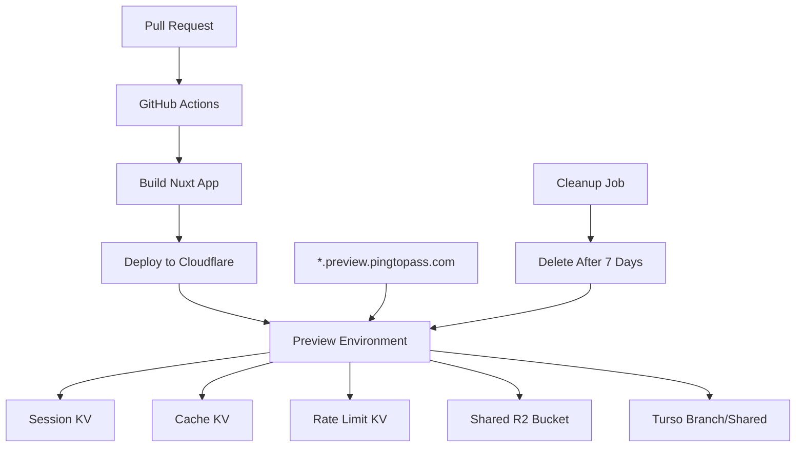

# Preview Environments Guide

## Overview

PingToPass uses dynamic preview environments for testing pull requests before merging. Each PR gets its own isolated environment with a unique URL like `pr-123-feature.preview.pingtopass.com`.

## Architecture



## Features

### Cost Optimization
- **Budget**: < $5/month for all preview environments
- **Resource Sharing**: Shared R2 bucket for assets
- **Auto-cleanup**: Previews deleted after 7 days or PR closure
- **Limits**: Maximum 10 concurrent preview environments

### Preview-Only Features
- Debug panel with environment info
- Feature flags enabled by default
- Mock data support for testing
- Unlimited questions and exams
- Performance monitoring
- Verbose logging

### Isolation
- Separate KV namespaces per preview
- Optional Turso database branches
- Independent worker deployments
- No shared state between previews

## Quick Start

### Creating a Preview

1. **Automatic**: Open a PR against `main` or `develop`
   ```bash
   git checkout -b feature/new-feature
   git push origin feature/new-feature
   gh pr create
   ```

2. **Manual**: Use the management script
   ```bash
   ./scripts/manage-preview.sh create 123 feature/new-feature
   ```

### Accessing Preview

After deployment, access your preview at:
- Main URL: `https://pr-123-feature.preview.pingtopass.com`
- API Health: `https://pr-123-feature.preview.pingtopass.com/api/health`
- Preview Info: `https://pr-123-feature.preview.pingtopass.com/api/preview/info`

### Managing Previews

```bash
# List all preview environments
./scripts/manage-preview.sh list

# List with details (status, age, etc.)
./scripts/manage-preview.sh list --detailed

# Delete a specific preview
./scripts/manage-preview.sh delete pr-123-feature

# Clean up expired previews
./scripts/manage-preview.sh cleanup

# Monitor resource usage
./scripts/manage-preview.sh monitor
```

## Configuration

### Environment Variables

Preview environments have these special variables:

```env
# Preview identification
ENVIRONMENT=preview
PREVIEW_MODE=true
PREVIEW_PR_NUMBER=123
PREVIEW_BRANCH_NAME=feature/new-feature
PREVIEW_CREATED_AT=2024-01-01T00:00:00Z

# Feature flags
FEATURE_FLAGS_ENABLED=true
DEBUG_MODE=true
MOCK_DATA_ENABLED=false
ANALYTICS_ENABLED=false

# Resource limits
MAX_REQUESTS_PER_MINUTE=1000
MAX_CACHE_SIZE_MB=50
PREVIEW_TTL_DAYS=7
DATABASE_POOL_SIZE=1
WORKER_TIMEOUT_MS=10000
```

### Feature Flags

Enable features via query parameters:
- `?_debug=true` - Enable debug mode
- `?_mock=true` - Use mock data
- `?_features=beta-ui,debug-panel` - Enable specific features

### DNS Setup

One-time setup required:

1. Create wildcard CNAME record:
   ```
   *.preview.pingtopass.com → preview.pingtopass.workers.dev
   ```

2. Configure Workers route in `wrangler.toml`:
   ```toml
   [[env.preview.routes]]
   pattern = "*.preview.pingtopass.com/*"
   zone_name = "pingtopass.com"
   ```

See [DNS Setup Guide](./PREVIEW_DNS_SETUP.md) for detailed instructions.

## Testing in Preview

### Manual Testing Checklist

1. **Core Functionality**
   - [ ] Homepage loads correctly
   - [ ] API endpoints respond
   - [ ] Database connection works
   - [ ] Authentication flow completes

2. **Preview Features**
   - [ ] Debug panel visible (Ctrl+Shift+D to toggle)
   - [ ] Feature flags working
   - [ ] Mock data available if enabled
   - [ ] Performance metrics displayed

3. **Performance**
   - [ ] Response time < 200ms
   - [ ] No console errors
   - [ ] Assets load correctly

### Automated Tests

Preview deployments automatically run:
- Health checks
- Basic smoke tests
- Performance tests

Results are posted as PR comments.

## Debug Panel

Preview environments include a debug panel showing:
- PR number and branch name
- Creation time and TTL
- Enabled features
- Quick links to endpoints
- Performance metrics

Toggle with: `Ctrl+Shift+D`

## Cost Management

### Current Limits
- **Max Previews**: 10 concurrent
- **TTL**: 7 days
- **Requests**: 100k/day free tier
- **KV Operations**: 100k/day free tier

### Cost Breakdown
- **10 previews**: ~$0.00/month (within free tier)
- **With traffic**: ~$1-5/month
- **Cleanup savings**: ~$10/month

### Optimization Tips
1. Use shared resources (R2 bucket)
2. Aggressive caching (1 hour TTL)
3. Small database pools (1 connection)
4. Automatic cleanup after PR closure

## Troubleshooting

### Preview Not Loading

1. Check deployment status:
   ```bash
   wrangler tail --env preview
   ```

2. Verify DNS propagation:
   ```bash
   dig pr-123.preview.pingtopass.com
   ```

3. Check worker logs:
   ```bash
   wrangler tail pingtopass-pr-123-feature
   ```

### SSL Certificate Errors

- Wait 5-10 minutes for Universal SSL
- Or enable Advanced Certificate Manager

### Cleanup Not Working

1. Check GitHub Actions:
   ```bash
   gh workflow view preview-cleanup
   ```

2. Run manual cleanup:
   ```bash
   ./scripts/manage-preview.sh cleanup
   ```

3. Check for orphaned resources:
   ```bash
   wrangler kv:namespace list | grep pr-
   ```

### Resource Limits Exceeded

1. Check active previews:
   ```bash
   ./scripts/manage-preview.sh list --detailed
   ```

2. Force cleanup old previews:
   ```bash
   PREVIEW_TTL_DAYS=3 ./scripts/manage-preview.sh cleanup
   ```

## Automation

### GitHub Actions

- **On PR Open**: Create preview
- **On PR Update**: Redeploy preview
- **On PR Close**: Delete preview
- **Scheduled**: Cleanup every 6 hours

### Cron Job

For additional cleanup, add to crontab:
```bash
0 */6 * * * /path/to/scripts/preview-cleanup-cron.sh
```

### Monitoring

Set up alerts for:
- Preview count > 8 (approaching limit)
- Failed deployments
- Orphaned resources
- High request rates

## Best Practices

1. **Always test in preview** before merging
2. **Close PRs promptly** to free resources
3. **Use feature flags** for experimental features
4. **Monitor costs** weekly
5. **Document preview-only code** clearly

## API Reference

### Preview Info Endpoint

```http
GET /api/preview/info
```

Returns detailed preview environment information:

```json
{
  "deployment": {
    "environment": "preview",
    "prNumber": "123",
    "branchName": "feature/new-ui",
    "url": "https://pr-123-feature.preview.pingtopass.com",
    "ttlDays": "7"
  },
  "expiration": {
    "expiresAt": "2024-01-08T00:00:00Z",
    "daysRemaining": 6,
    "status": "active"
  },
  "features": {
    "enabled": ["debugPanel", "betaUI", "mockPayments"],
    "all": { ... }
  },
  "resourceUsage": {
    "requests": { "today": 1234, "limit": 100000 },
    "estimatedCost": { "daily": 0.05, "monthly": 1.50 }
  },
  "quickLinks": { ... },
  "testingChecklist": [ ... ]
}
```

## Support

- **Documentation**: This guide
- **Scripts**: `/scripts/manage-preview.sh`
- **Workflows**: `.github/workflows/preview*.yml`
- **Slack**: #deployments channel

---

**Remember**: Preview environments are temporary. Don't store important data there!