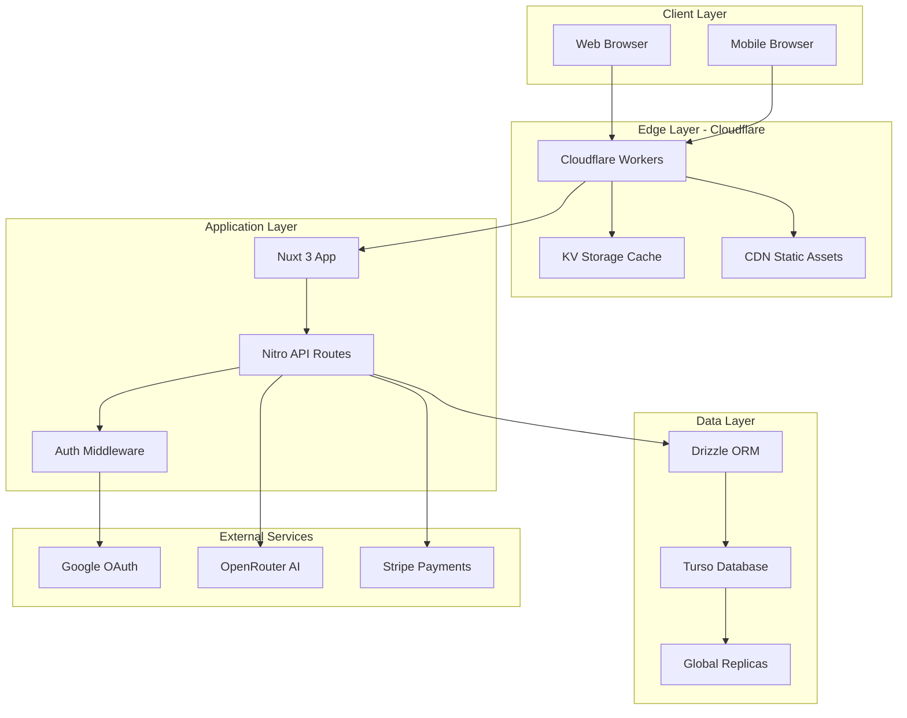

# PingToPass Architecture Overview

## Executive Summary

PingToPass is a modern IT certification exam platform built on **Cloudflare Workers** with **Nuxt 3**, **Turso** edge database, and **Drizzle ORM**. This architecture delivers sub-200ms response times globally while maintaining a budget under $50/month.

## Core Architecture Decisions

### 1. Runtime: Cloudflare Workers (Not Pages)
- **Why Workers**: Pages is being discontinued; Workers provides better control and performance
- **Benefits**: Global edge deployment, automatic scaling, built-in DDoS protection
- **Cost**: $5/month base + usage-based pricing

### 2. Database: Turso with Drizzle ORM
- **Why Turso**: SQLite at the edge with global replication
- **Why Drizzle**: Type-safe queries, excellent TypeScript support, migration management
- **Benefits**: <50ms queries globally, free tier covers development
- **Schema Management**: Drizzle Kit for migrations and schema generation

### 3. Framework: Nuxt 3 with Nitro
- **Why Nuxt**: Full-stack Vue framework with SSR/SSG/SPA support
- **Why Nitro**: Universal deployment to any platform, especially Workers
- **Benefits**: File-based routing, auto-imports, built-in optimization

## System Components



## Technology Stack

### Frontend
- **Framework**: Vue 3 via Nuxt 3
- **UI Library**: Nuxt UI (based on Tailwind + Headless UI)
- **State Management**: Pinia
- **Form Handling**: VeeValidate with Zod
- **Testing**: Vitest + @testing-library/vue

### Backend
- **Runtime**: Cloudflare Workers
- **Framework**: Nitro (Nuxt's server engine)
- **Database ORM**: Drizzle ORM
- **Database**: Turso (libSQL)
- **Authentication**: JWT with Google OAuth
- **API Design**: RESTful with typed endpoints

### Infrastructure
- **Hosting**: Cloudflare Workers
- **Database**: Turso with global replicas
- **CDN**: Cloudflare's global network
- **Caching**: Cloudflare KV
- **DNS**: Cloudflare DNS

### Development Tools
- **Package Manager**: pnpm
- **Build Tool**: Vite
- **Type Checking**: TypeScript strict mode
- **Linting**: ESLint with Nuxt config
- **Testing**: Vitest + Playwright
- **Database Tools**: Drizzle Kit + Drizzle Studio

## Key Design Patterns

### 1. Edge-First Architecture
All compute happens at the edge closest to users:
```typescript
// Automatic edge routing with Turso
const db = drizzle(createClient({
  url: process.env.TURSO_DATABASE_URL, // Automatically routes to nearest replica
  authToken: process.env.TURSO_AUTH_TOKEN,
}));
```

### 2. Type-Safe Database Operations
Using Drizzle ORM for compile-time safety:
```typescript
// Type-safe queries with full IntelliSense
const exams = await db
  .select()
  .from(schema.exams)
  .where(eq(schema.exams.isActive, true))
  .orderBy(schema.exams.vendor);
```

### 3. File-Based API Routes
Nuxt's file system routing for APIs:
```
server/
  api/
    auth/
      google.post.ts    # POST /api/auth/google
      verify.get.ts     # GET /api/auth/verify
    exams/
      index.get.ts      # GET /api/exams
      [code].get.ts     # GET /api/exams/:code
```

### 4. Composable Business Logic
Reusable logic with Vue composables:
```typescript
// composables/useExam.ts
export const useExam = () => {
  const exam = useState<Exam>('current-exam');
  const loading = useState<boolean>('exam-loading', () => false);
  
  const loadExam = async (code: string) => {
    loading.value = true;
    exam.value = await $fetch(`/api/exams/${code}`);
    loading.value = false;
  };
  
  return { exam: readonly(exam), loading: readonly(loading), loadExam };
};
```

## Performance Strategy

### 1. Global Distribution
- Turso replicas in 4+ regions
- Cloudflare Workers in 200+ cities
- Automatic routing to nearest edge

### 2. Caching Layers
```
Browser Cache → Cloudflare CDN → Workers KV → Turso Embedded Replicas
     1hr            24hr            5min           Real-time
```

### 3. Query Optimization
- Indexed queries with Drizzle
- Prepared statements for hot paths
- Batch operations for bulk inserts

### 4. Asset Optimization
- Automatic code splitting
- Image optimization via Cloudflare
- Brotli compression

## Security Architecture

### 1. Authentication & Authorization
- JWT tokens with secure httpOnly cookies
- Google OAuth for identity verification
- Role-based access control (RBAC)

### 2. Data Protection
- All SQL queries via Drizzle ORM (no raw SQL)
- Input validation with Zod schemas
- Rate limiting at edge

### 3. Infrastructure Security
- DDoS protection via Cloudflare
- WAF rules for common attacks
- Encrypted database connections

## Development Workflow

### 1. Local Development
```bash
# Start development server with hot reload
pnpm dev

# Run database migrations
pnpm drizzle-kit push:sqlite

# Run tests in watch mode
pnpm test:watch
```

### 2. Testing Strategy
- **Unit Tests**: 90% coverage for business logic
- **Integration Tests**: API endpoint testing
- **E2E Tests**: Critical user journeys
- **Performance Tests**: Sub-200ms response times

### 3. Deployment Pipeline
```bash
# Preview deployment (automatic on PR)
wrangler deploy --env preview

# Production deployment (on main branch)
wrangler deploy --env production
```

## Cost Analysis

### Monthly Infrastructure Costs
- **Cloudflare Workers**: $5 base + ~$10 usage = $15
- **Turso Database**: Free tier (500 databases, 9GB storage)
- **Domain**: $12/year = $1/month
- **Total**: ~$16/month

### Scaling Costs
- 1M requests/month: ~$16
- 10M requests/month: ~$25
- 100M requests/month: ~$55

## Migration from FastAPI/MongoDB

### What Changed
1. **FastAPI → Nuxt 3**: Unified full-stack framework
2. **MongoDB → Turso**: Edge-native SQL database
3. **Raw SQL → Drizzle ORM**: Type-safe database operations
4. **Cloudflare Pages → Workers**: Better control and features
5. **Docker → Native Edge**: No containers needed

### What Stayed
1. Google OAuth authentication
2. RESTful API design
3. TDD methodology
4. Core business logic

## Monitoring & Observability

### 1. Application Monitoring
- Cloudflare Analytics dashboard
- Custom metrics via Workers Analytics API
- Error tracking with structured logging

### 2. Database Monitoring
```bash
# Database inspection
turso db inspect pingtopass-prod

# Query performance
turso db shell pingtopass-prod "EXPLAIN QUERY PLAN SELECT ..."
```

### 3. Performance Monitoring
- Real User Monitoring (RUM) via Cloudflare
- Synthetic monitoring with Playwright
- Load testing with k6

## Disaster Recovery

### 1. Backup Strategy
- Automated daily database backups
- Git repository for code versioning
- Environment secrets in secure storage

### 2. Rollback Procedures
```bash
# Quick rollback to previous deployment
wrangler rollback [deployment-id] --env production

# Database rollback
turso db restore pingtopass-prod backup-20240101.sql
```

### 3. High Availability
- Multiple Turso replicas for failover
- Cloudflare's anycast network
- Zero-downtime deployments

## Future Enhancements

### Phase 1 (Current)
- ✅ Core platform with Cloudflare Workers
- ✅ Drizzle ORM integration
- ✅ Google OAuth
- ⏳ Basic exam delivery

### Phase 2 (Q2 2024)
- Stripe payment integration
- AI question generation
- Advanced analytics

### Phase 3 (Q3 2024)
- Mobile app with Capacitor
- Offline mode support
- Enterprise features

## Documentation Index

1. **[API_SPECIFICATION.md](./API_SPECIFICATION.md)** - Complete API documentation with Drizzle examples
2. **[TURSO_SCHEMA.md](./TURSO_SCHEMA.md)** - Database schema with Drizzle ORM definitions
3. **[CLOUDFLARE_DEPLOYMENT.md](./CLOUDFLARE_DEPLOYMENT.md)** - Workers deployment guide
4. **[TDD_FRAMEWORK.md](./TDD_FRAMEWORK.md)** - Testing strategy with Drizzle integration

## Quick Start

```bash
# Clone repository
git clone https://github.com/ciscoittech/pingtopass-nuxt.git
cd pingtopass-nuxt

# Install dependencies
pnpm install

# Setup environment
cp .env.example .env.local
# Edit .env.local with your credentials

# Setup database
turso db create pingtopass-dev
pnpm drizzle-kit push:sqlite

# Start development
pnpm dev

# Deploy to Cloudflare Workers
wrangler deploy
```

## Support & Resources

- **Repository**: https://github.com/ciscoittech/pingtopass-nuxt
- **Cloudflare Docs**: https://developers.cloudflare.com/workers/
- **Turso Docs**: https://docs.turso.tech/
- **Drizzle Docs**: https://orm.drizzle.team/
- **Nuxt Docs**: https://nuxt.com/docs