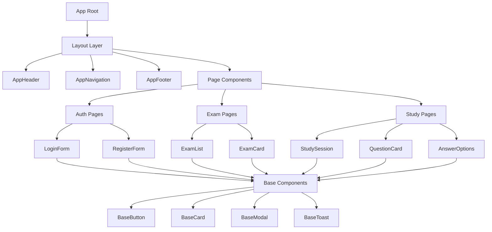

# UI Technical Architecture - PingToPass

## Executive Summary

This document defines the comprehensive technical architecture for PingToPass UI components using Vue 3 Composition API, TypeScript, and Nuxt 3's auto-import capabilities. The architecture emphasizes performance (<100ms interactions), accessibility (WCAG 2.1 AA), and mobile-first responsive design.

## 1. Component Architecture

### 1.1 Component Hierarchy

```
App Root
├── layouts/
│   └── default.vue (AppLayout)
│       ├── components/layout/AppHeader.vue
│       ├── components/layout/AppNavigation.vue
│       └── components/layout/AppFooter.vue
├── pages/
│   ├── index.vue (Landing)
│   ├── auth/
│   │   ├── login.vue
│   │   └── register.vue
│   ├── dashboard/
│   │   └── index.vue
│   ├── exams/
│   │   ├── index.vue (ExamList)
│   │   └── [id]/
│   │       ├── index.vue (ExamDetail)
│   │       ├── study.vue (StudySession)
│   │       └── test.vue (TestSimulation)
│   └── profile/
│       └── index.vue
└── components/
    ├── base/           # Atomic components
    ├── auth/           # Authentication components
    ├── exam/           # Exam-related components
    ├── study/          # Study interface components
    └── common/         # Shared components
```

### 1.2 Component Relationships



## 2. State Management Architecture

### 2.1 Pinia Store Structure

```typescript
// stores/index.ts
export interface StoreStructure {
  auth: AuthStore;           // Authentication state
  user: UserStore;           // User profile and preferences
  exam: ExamStore;           // Exam catalog and metadata
  study: StudyStore;         // Active study session
  progress: ProgressStore;   // User progress tracking
  ui: UIStore;              // UI state (modals, toasts, etc.)
}
```

### 2.2 Store Definitions

```typescript
// stores/auth.ts
import { defineStore } from 'pinia';
import type { User } from '~/types';

interface AuthState {
  user: User | null;
  token: string | null;
  isAuthenticated: boolean;
  isLoading: boolean;
}

export const useAuthStore = defineStore('auth', () => {
  // State
  const user = ref<User | null>(null);
  const token = useCookie('auth-token');
  const isAuthenticated = computed(() => !!user.value && !!token.value);
  const isLoading = ref(false);

  // Actions
  async function login(credentials: LoginCredentials) {
    isLoading.value = true;
    try {
      const { data } = await $fetch('/api/auth/google', {
        method: 'POST',
        body: credentials
      });
      user.value = data.user;
      token.value = data.token;
      await navigateTo('/dashboard');
    } finally {
      isLoading.value = false;
    }
  }

  async function logout() {
    user.value = null;
    token.value = null;
    await navigateTo('/');
  }

  async function checkAuth() {
    if (!token.value) return;
    
    try {
      const data = await $fetch('/api/auth/verify');
      user.value = data;
    } catch {
      await logout();
    }
  }

  return {
    user: readonly(user),
    token: readonly(token),
    isAuthenticated,
    isLoading: readonly(isLoading),
    login,
    logout,
    checkAuth
  };
});
```

```typescript
// stores/study.ts
import { defineStore } from 'pinia';
import type { Question, Answer, StudySession } from '~/types';

interface StudyState {
  session: StudySession | null;
  currentQuestion: Question | null;
  questionIndex: number;
  answers: Map<string, Answer>;
  timeRemaining: number;
  isPaused: boolean;
}

export const useStudyStore = defineStore('study', () => {
  // State
  const session = ref<StudySession | null>(null);
  const currentQuestion = ref<Question | null>(null);
  const questionIndex = ref(0);
  const answers = ref(new Map<string, Answer>());
  const timeRemaining = ref(0);
  const isPaused = ref(false);

  // Computed
  const progress = computed(() => ({
    current: questionIndex.value + 1,
    total: session.value?.questions.length || 0,
    percentage: ((questionIndex.value + 1) / (session.value?.questions.length || 1)) * 100
  }));

  const score = computed(() => {
    let correct = 0;
    answers.value.forEach(answer => {
      if (answer.isCorrect) correct++;
    });
    return {
      correct,
      total: answers.value.size,
      percentage: (correct / Math.max(answers.value.size, 1)) * 100
    };
  });

  // Actions
  async function startSession(examId: string, mode: 'practice' | 'timed' | 'exam') {
    const data = await $fetch(`/api/study/start`, {
      method: 'POST',
      body: { examId, mode }
    });
    
    session.value = data.session;
    currentQuestion.value = data.session.questions[0];
    questionIndex.value = 0;
    answers.value.clear();
    
    if (mode === 'timed' || mode === 'exam') {
      timeRemaining.value = data.session.timeLimit;
      startTimer();
    }
  }

  function submitAnswer(questionId: string, selectedOptions: string[]) {
    answers.value.set(questionId, {
      questionId,
      selectedOptions,
      isCorrect: checkAnswer(questionId, selectedOptions),
      timestamp: Date.now()
    });
    
    if (questionIndex.value < session.value!.questions.length - 1) {
      nextQuestion();
    } else {
      completeSession();
    }
  }

  async function completeSession() {
    const results = await $fetch('/api/study/complete', {
      method: 'POST',
      body: {
        sessionId: session.value!.id,
        answers: Array.from(answers.value.values())
      }
    });
    
    await navigateTo(`/results/${results.id}`);
  }

  return {
    session: readonly(session),
    currentQuestion: readonly(currentQuestion),
    questionIndex: readonly(questionIndex),
    progress,
    score,
    timeRemaining: readonly(timeRemaining),
    isPaused: readonly(isPaused),
    startSession,
    submitAnswer,
    pauseSession,
    resumeSession,
    nextQuestion,
    previousQuestion
  };
});
```

## 3. Type Definitions

### 3.1 Core Types

```typescript
// types/index.ts
export interface User {
  id: string;
  email: string;
  name: string | null;
  googleId: string | null;
  stripeCustomerId: string | null;
  subscriptionTier: 'free' | 'pro' | 'enterprise';
  createdAt: Date;
  updatedAt: Date;
}

export interface Exam {
  id: string;
  code: string;
  name: string;
  vendor: string;
  description: string | null;
  passingScore: number;
  timeLimit: number | null;
  questionCount: number;
  isActive: boolean;
  createdAt: Date;
  updatedAt: Date;
}

export interface Question {
  id: string;
  examId: string;
  type: 'single' | 'multiple' | 'drag-drop';
  text: string;
  explanation: string | null;
  difficulty: 1 | 2 | 3 | 4 | 5;
  objectiveId: string | null;
  options: AnswerOption[];
  isActive: boolean;
  aiGenerated: boolean;
}

export interface AnswerOption {
  id: string;
  text: string;
  isCorrect: boolean;
  order: number;
}

export interface StudySession {
  id: string;
  userId: string;
  examId: string;
  mode: 'practice' | 'timed' | 'exam';
  questions: Question[];
  timeLimit: number | null;
  startedAt: Date;
}

export interface Answer {
  questionId: string;
  selectedOptions: string[];
  isCorrect: boolean;
  timestamp: number;
}
```

### 3.2 Component Props Types

```typescript
// types/components.ts

// Base Components
export interface BaseButtonProps {
  variant?: 'primary' | 'secondary' | 'ghost' | 'danger';
  size?: 'sm' | 'md' | 'lg';
  loading?: boolean;
  disabled?: boolean;
  fullWidth?: boolean;
  type?: 'button' | 'submit' | 'reset';
  icon?: string;
  iconPosition?: 'left' | 'right';
}

export interface BaseCardProps {
  padding?: 'none' | 'sm' | 'md' | 'lg';
  shadow?: 'none' | 'sm' | 'md' | 'lg' | 'xl';
  border?: boolean;
  hoverable?: boolean;
  clickable?: boolean;
}

export interface BaseModalProps {
  modelValue: boolean;
  title?: string;
  size?: 'sm' | 'md' | 'lg' | 'xl' | 'full';
  persistent?: boolean;
  closeOnEscape?: boolean;
  closeOnClickOutside?: boolean;
}

export interface BaseToastProps {
  message: string;
  type?: 'success' | 'error' | 'warning' | 'info';
  duration?: number;
  position?: 'top-right' | 'top-left' | 'bottom-right' | 'bottom-left' | 'top-center' | 'bottom-center';
  persistent?: boolean;
}

// Exam Components
export interface ExamCardProps {
  exam: Exam;
  showProgress?: boolean;
  showActions?: boolean;
  compact?: boolean;
}

export interface QuestionCardProps {
  question: Question;
  questionNumber?: number;
  totalQuestions?: number;
  showExplanation?: boolean;
  disabled?: boolean;
  selectedOptions?: string[];
}

export interface AnswerOptionsProps {
  options: AnswerOption[];
  type: 'single' | 'multiple';
  selectedOptions?: string[];
  disabled?: boolean;
  showCorrect?: boolean;
}

export interface ExamTimerProps {
  duration: number; // in seconds
  onTimeUp?: () => void;
  paused?: boolean;
  warning?: number; // warning threshold in seconds
}

// Study Components
export interface StudySessionProps {
  examId: string;
  mode: 'practice' | 'timed' | 'exam';
}

export interface ProgressDashboardProps {
  userId: string;
  examId?: string;
  timeRange?: 'week' | 'month' | 'year' | 'all';
}
```

## 4. Composables Architecture

### 4.1 Core Composables

```typescript
// composables/useAuth.ts
export const useAuth = () => {
  const authStore = useAuthStore();
  const router = useRouter();
  
  const requireAuth = async (redirectTo = '/auth/login') => {
    if (!authStore.isAuthenticated) {
      await router.push(redirectTo);
      throw new Error('Authentication required');
    }
  };
  
  const requireSubscription = async (tier: 'pro' | 'enterprise') => {
    await requireAuth();
    const userTier = authStore.user?.subscriptionTier;
    
    if (userTier === 'free' || (tier === 'enterprise' && userTier === 'pro')) {
      await router.push('/pricing');
      throw new Error('Subscription upgrade required');
    }
  };
  
  return {
    user: authStore.user,
    isAuthenticated: authStore.isAuthenticated,
    login: authStore.login,
    logout: authStore.logout,
    requireAuth,
    requireSubscription
  };
};
```

```typescript
// composables/useApi.ts
export const useApi = () => {
  const authStore = useAuthStore();
  
  const api = $fetch.create({
    onRequest({ options }) {
      if (authStore.token) {
        options.headers = {
          ...options.headers,
          Authorization: `Bearer ${authStore.token}`
        };
      }
    },
    onResponseError({ response }) {
      if (response.status === 401) {
        authStore.logout();
      }
    }
  });
  
  return api;
};
```

```typescript
// composables/useToast.ts
interface ToastOptions {
  message: string;
  type?: 'success' | 'error' | 'warning' | 'info';
  duration?: number;
  persistent?: boolean;
}

export const useToast = () => {
  const toasts = useState<ToastOptions[]>('toasts', () => []);
  
  const show = (options: ToastOptions | string) => {
    const toast = typeof options === 'string' 
      ? { message: options, type: 'info' as const, duration: 3000 }
      : { type: 'info' as const, duration: 3000, ...options };
    
    const id = Date.now();
    toasts.value.push({ ...toast, id });
    
    if (!toast.persistent) {
      setTimeout(() => {
        dismiss(id);
      }, toast.duration);
    }
    
    return id;
  };
  
  const dismiss = (id: number) => {
    const index = toasts.value.findIndex(t => t.id === id);
    if (index > -1) {
      toasts.value.splice(index, 1);
    }
  };
  
  const success = (message: string) => show({ message, type: 'success' });
  const error = (message: string) => show({ message, type: 'error', duration: 5000 });
  const warning = (message: string) => show({ message, type: 'warning' });
  const info = (message: string) => show({ message, type: 'info' });
  
  return {
    toasts: readonly(toasts),
    show,
    dismiss,
    success,
    error,
    warning,
    info
  };
};
```

```typescript
// composables/useTimer.ts
export const useTimer = (duration: number, options?: {
  onTick?: (remaining: number) => void;
  onComplete?: () => void;
  autoStart?: boolean;
}) => {
  const remaining = ref(duration);
  const isRunning = ref(false);
  const isPaused = ref(false);
  let interval: NodeJS.Timeout | null = null;
  
  const start = () => {
    if (isRunning.value) return;
    
    isRunning.value = true;
    isPaused.value = false;
    
    interval = setInterval(() => {
      if (!isPaused.value) {
        remaining.value--;
        options?.onTick?.(remaining.value);
        
        if (remaining.value <= 0) {
          stop();
          options?.onComplete?.();
        }
      }
    }, 1000);
  };
  
  const pause = () => {
    isPaused.value = true;
  };
  
  const resume = () => {
    isPaused.value = false;
  };
  
  const stop = () => {
    if (interval) {
      clearInterval(interval);
      interval = null;
    }
    isRunning.value = false;
    isPaused.value = false;
  };
  
  const reset = () => {
    stop();
    remaining.value = duration;
  };
  
  const formatted = computed(() => {
    const hours = Math.floor(remaining.value / 3600);
    const minutes = Math.floor((remaining.value % 3600) / 60);
    const seconds = remaining.value % 60;
    
    if (hours > 0) {
      return `${hours}:${minutes.toString().padStart(2, '0')}:${seconds.toString().padStart(2, '0')}`;
    }
    return `${minutes}:${seconds.toString().padStart(2, '0')}`;
  });
  
  if (options?.autoStart) {
    start();
  }
  
  onUnmounted(() => {
    stop();
  });
  
  return {
    remaining: readonly(remaining),
    formatted,
    isRunning: readonly(isRunning),
    isPaused: readonly(isPaused),
    start,
    pause,
    resume,
    stop,
    reset
  };
};
```

## 5. API Integration Patterns

### 5.1 API Client Pattern

```typescript
// utils/api-client.ts
export class ApiClient {
  private baseURL: string;
  private fetch: typeof $fetch;
  
  constructor() {
    this.baseURL = useRuntimeConfig().public.siteUrl;
    this.fetch = $fetch.create({
      baseURL: this.baseURL,
      headers: {
        'Content-Type': 'application/json'
      },
      onRequest: this.onRequest.bind(this),
      onResponseError: this.onResponseError.bind(this)
    });
  }
  
  private onRequest({ options }) {
    const authStore = useAuthStore();
    if (authStore.token) {
      options.headers.Authorization = `Bearer ${authStore.token}`;
    }
  }
  
  private onResponseError({ response }) {
    const toast = useToast();
    
    switch (response.status) {
      case 401:
        useAuthStore().logout();
        toast.error('Session expired. Please login again.');
        break;
      case 403:
        toast.error('You do not have permission to perform this action.');
        break;
      case 404:
        toast.error('Resource not found.');
        break;
      case 429:
        toast.error('Too many requests. Please try again later.');
        break;
      case 500:
        toast.error('Server error. Please try again later.');
        break;
      default:
        toast.error(response._data?.message || 'An error occurred.');
    }
  }
  
  // Exam endpoints
  async getExams() {
    return this.fetch<Exam[]>('/api/exams');
  }
  
  async getExam(id: string) {
    return this.fetch<Exam>(`/api/exams/${id}`);
  }
  
  // Question endpoints
  async getQuestions(examId: string, options?: {
    limit?: number;
    difficulty?: number;
    objectiveId?: string;
  }) {
    return this.fetch<Question[]>('/api/questions', {
      params: { examId, ...options }
    });
  }
  
  // Study session endpoints
  async startStudySession(examId: string, mode: 'practice' | 'timed' | 'exam') {
    return this.fetch<StudySession>('/api/study/start', {
      method: 'POST',
      body: { examId, mode }
    });
  }
  
  async submitAnswer(sessionId: string, questionId: string, selectedOptions: string[]) {
    return this.fetch('/api/study/answer', {
      method: 'POST',
      body: { sessionId, questionId, selectedOptions }
    });
  }
  
  async completeSession(sessionId: string) {
    return this.fetch('/api/study/complete', {
      method: 'POST',
      body: { sessionId }
    });
  }
}

// Export singleton instance
export const apiClient = new ApiClient();
```

### 5.2 Data Fetching Pattern

```typescript
// composables/useExamData.ts
export const useExamData = (examId: MaybeRef<string>) => {
  const id = toRef(examId);
  
  const { data: exam, pending, error, refresh } = await useFetch(`/api/exams/${id.value}`, {
    key: `exam-${id.value}`,
    server: true,
    lazy: false,
    transform: (data) => transformExamData(data),
    getCachedData(key) {
      const nuxtApp = useNuxtApp();
      return nuxtApp.payload.data[key] || nuxtApp.static.data[key];
    }
  });
  
  const { data: questions } = await useFetch(`/api/questions`, {
    key: `questions-${id.value}`,
    params: { examId: id.value },
    server: false,
    lazy: true
  });
  
  return {
    exam,
    questions,
    pending,
    error,
    refresh
  };
};
```

## 6. Styling Architecture

### 6.1 CSS Architecture (UnoCSS/Tailwind)

```typescript
// uno.config.ts
import { defineConfig, presetUno, presetIcons, presetWebFonts } from 'unocss';

export default defineConfig({
  presets: [
    presetUno(),
    presetIcons({
      scale: 1.2,
      cdn: 'https://esm.sh/'
    }),
    presetWebFonts({
      fonts: {
        sans: 'Inter:400,500,600,700',
        mono: 'Fira Code:400,500'
      }
    })
  ],
  theme: {
    colors: {
      primary: {
        50: '#eff6ff',
        500: '#3b82f6',
        600: '#2563eb',
        700: '#1d4ed8',
        900: '#1e3a8a'
      },
      success: {
        500: '#10b981',
        600: '#059669'
      },
      warning: {
        500: '#f59e0b',
        600: '#d97706'
      },
      error: {
        500: '#ef4444',
        600: '#dc2626'
      }
    }
  },
  shortcuts: {
    'btn': 'px-4 py-2 rounded-lg font-medium transition-colors focus:outline-none focus:ring-2 focus:ring-offset-2',
    'btn-primary': 'btn bg-primary-600 text-white hover:bg-primary-700 focus:ring-primary-500',
    'btn-secondary': 'btn bg-gray-200 text-gray-900 hover:bg-gray-300 focus:ring-gray-500',
    'card': 'bg-white rounded-lg shadow-md p-6',
    'input': 'w-full px-3 py-2 border border-gray-300 rounded-lg focus:outline-none focus:ring-2 focus:ring-primary-500'
  },
  safelist: [
    'text-primary-600',
    'bg-success-100',
    'border-error-500'
  ]
});
```

### 6.2 Component Styling Pattern

```vue
<!-- components/base/BaseButton.vue -->
<template>
  <button
    :type="type"
    :disabled="disabled || loading"
    :class="buttonClasses"
    @click="$emit('click', $event)"
  >
    <span v-if="loading" class="i-lucide-loader-2 animate-spin" />
    <span v-else-if="icon && iconPosition === 'left'" :class="icon" />
    <slot />
    <span v-if="icon && iconPosition === 'right' && !loading" :class="icon" />
  </button>
</template>

<script setup lang="ts">
import type { BaseButtonProps } from '~/types/components';

const props = withDefaults(defineProps<BaseButtonProps>(), {
  variant: 'primary',
  size: 'md',
  type: 'button',
  iconPosition: 'left'
});

const buttonClasses = computed(() => {
  const base = 'inline-flex items-center justify-center font-medium transition-colors focus:outline-none focus:ring-2 focus:ring-offset-2 disabled:opacity-50 disabled:cursor-not-allowed';
  
  const variants = {
    primary: 'bg-primary-600 text-white hover:bg-primary-700 focus:ring-primary-500',
    secondary: 'bg-gray-200 text-gray-900 hover:bg-gray-300 focus:ring-gray-500',
    ghost: 'bg-transparent hover:bg-gray-100 focus:ring-gray-500',
    danger: 'bg-error-600 text-white hover:bg-error-700 focus:ring-error-500'
  };
  
  const sizes = {
    sm: 'px-3 py-1.5 text-sm rounded-md gap-1.5',
    md: 'px-4 py-2 text-base rounded-lg gap-2',
    lg: 'px-6 py-3 text-lg rounded-lg gap-2.5'
  };
  
  return [
    base,
    variants[props.variant],
    sizes[props.size],
    props.fullWidth && 'w-full'
  ];
});
</script>
```

## 7. Testing Strategy

### 7.1 Component Testing Structure

```typescript
// tests/unit/components/base/BaseButton.test.ts
import { describe, it, expect } from 'vitest';
import { mount } from '@vue/test-utils';
import BaseButton from '~/components/base/BaseButton.vue';

describe('BaseButton', () => {
  describe('Props', () => {
    it('renders with default props', () => {
      const wrapper = mount(BaseButton);
      expect(wrapper.element.tagName).toBe('BUTTON');
      expect(wrapper.classes()).toContain('bg-primary-600');
    });
    
    it('applies variant classes correctly', () => {
      const wrapper = mount(BaseButton, {
        props: { variant: 'secondary' }
      });
      expect(wrapper.classes()).toContain('bg-gray-200');
    });
    
    it('disables button when loading', () => {
      const wrapper = mount(BaseButton, {
        props: { loading: true }
      });
      expect(wrapper.attributes('disabled')).toBeDefined();
    });
  });
  
  describe('Events', () => {
    it('emits click event', async () => {
      const wrapper = mount(BaseButton);
      await wrapper.trigger('click');
      expect(wrapper.emitted('click')).toBeTruthy();
    });
    
    it('does not emit click when disabled', async () => {
      const wrapper = mount(BaseButton, {
        props: { disabled: true }
      });
      await wrapper.trigger('click');
      expect(wrapper.emitted('click')).toBeFalsy();
    });
  });
  
  describe('Slots', () => {
    it('renders slot content', () => {
      const wrapper = mount(BaseButton, {
        slots: { default: 'Click me' }
      });
      expect(wrapper.text()).toContain('Click me');
    });
  });
  
  describe('Accessibility', () => {
    it('has correct ARIA attributes', () => {
      const wrapper = mount(BaseButton, {
        props: { loading: true }
      });
      expect(wrapper.attributes('aria-busy')).toBe('true');
    });
  });
});
```

### 7.2 Integration Testing

```typescript
// tests/integration/study-session.test.ts
import { describe, it, expect, beforeEach } from 'vitest';
import { setup, $fetch } from '@nuxt/test-utils';
import { mount } from '@vue/test-utils';
import StudySession from '~/pages/exams/[id]/study.vue';

describe('Study Session Integration', () => {
  await setup({
    // Test environment configuration
  });
  
  beforeEach(() => {
    // Reset stores
    const authStore = useAuthStore();
    authStore.$reset();
    
    // Mock authenticated user
    authStore.user = {
      id: 'test-user',
      email: 'test@example.com',
      subscriptionTier: 'pro'
    };
  });
  
  describe('Session Flow', () => {
    it('starts a practice session', async () => {
      const wrapper = mount(StudySession, {
        props: { examId: 'exam-1' }
      });
      
      await wrapper.find('[data-test="start-practice"]').trigger('click');
      
      const studyStore = useStudyStore();
      expect(studyStore.session).toBeDefined();
      expect(studyStore.session.mode).toBe('practice');
    });
    
    it('submits answer and advances to next question', async () => {
      const studyStore = useStudyStore();
      await studyStore.startSession('exam-1', 'practice');
      
      const wrapper = mount(QuestionCard, {
        props: {
          question: studyStore.currentQuestion,
          questionNumber: 1,
          totalQuestions: 10
        }
      });
      
      // Select answer
      await wrapper.find('[data-test="answer-option-1"]').trigger('click');
      await wrapper.find('[data-test="submit-answer"]').trigger('click');
      
      expect(studyStore.questionIndex).toBe(1);
      expect(studyStore.answers.size).toBe(1);
    });
    
    it('completes session and shows results', async () => {
      const studyStore = useStudyStore();
      await studyStore.startSession('exam-1', 'practice');
      
      // Answer all questions
      for (let i = 0; i < 10; i++) {
        await studyStore.submitAnswer(
          studyStore.currentQuestion.id,
          [studyStore.currentQuestion.options[0].id]
        );
      }
      
      expect(navigateTo).toHaveBeenCalledWith(
        expect.stringContaining('/results/')
      );
    });
  });
  
  describe('Timer Functionality', () => {
    it('starts timer for timed session', async () => {
      const studyStore = useStudyStore();
      await studyStore.startSession('exam-1', 'timed');
      
      expect(studyStore.timeRemaining).toBe(3600); // 1 hour
      
      // Wait 2 seconds
      await new Promise(resolve => setTimeout(resolve, 2000));
      
      expect(studyStore.timeRemaining).toBeLessThan(3600);
    });
    
    it('pauses and resumes timer', async () => {
      const studyStore = useStudyStore();
      await studyStore.startSession('exam-1', 'timed');
      
      const initialTime = studyStore.timeRemaining;
      await studyStore.pauseSession();
      
      // Wait 1 second while paused
      await new Promise(resolve => setTimeout(resolve, 1000));
      
      expect(studyStore.timeRemaining).toBe(initialTime);
      
      await studyStore.resumeSession();
      
      // Wait 1 second after resume
      await new Promise(resolve => setTimeout(resolve, 1000));
      
      expect(studyStore.timeRemaining).toBeLessThan(initialTime);
    });
  });
});
```

### 7.3 E2E Testing

```typescript
// tests/e2e/complete-exam-flow.spec.ts
import { test, expect } from '@playwright/test';

test.describe('Complete Exam Flow', () => {
  test.beforeEach(async ({ page }) => {
    // Setup authenticated session
    await page.goto('/');
    await page.evaluate(() => {
      localStorage.setItem('auth-token', 'test-token');
    });
  });
  
  test('user completes full exam simulation', async ({ page }) => {
    // Navigate to exams
    await page.goto('/exams');
    await expect(page.locator('h1')).toContainText('Available Exams');
    
    // Select CCNA exam
    await page.click('[data-test="exam-card-CCNA"]');
    await expect(page).toHaveURL(/\/exams\/[\w-]+$/);
    
    // Start exam simulation
    await page.click('[data-test="start-exam"]');
    await expect(page.locator('[data-test="exam-timer"]')).toBeVisible();
    
    // Answer questions
    for (let i = 0; i < 10; i++) {
      await page.locator('[data-test="answer-option"]:first-child').click();
      await page.click('[data-test="next-question"]');
    }
    
    // Complete exam
    await page.click('[data-test="finish-exam"]');
    await page.click('[data-test="confirm-finish"]');
    
    // Check results
    await expect(page).toHaveURL(/\/results\/[\w-]+$/);
    await expect(page.locator('[data-test="exam-score"]')).toBeVisible();
    await expect(page.locator('[data-test="exam-passed"]')).toBeVisible();
  });
  
  test('timer expires during exam', async ({ page }) => {
    await page.goto('/exams/exam-1/test');
    
    // Mock timer expiration
    await page.evaluate(() => {
      window.dispatchEvent(new CustomEvent('timer-expired'));
    });
    
    // Should auto-submit and redirect to results
    await expect(page).toHaveURL(/\/results\/[\w-]+$/);
    await expect(page.locator('[data-test="time-expired-notice"]')).toBeVisible();
  });
});
```

## 8. Performance Optimization

### 8.1 Component Optimization

```typescript
// Lazy loading heavy components
const HeavyChart = defineAsyncComponent(() => 
  import('~/components/charts/ProgressChart.vue')
);

// Memo optimization for expensive computations
const expensiveComputation = useMemo(() => {
  return computed(() => {
    // Heavy calculation
    return processLargeDataSet(data.value);
  });
});

// Virtual scrolling for large lists
const VirtualList = defineAsyncComponent(() =>
  import('@tanstack/vue-virtual')
);
```

### 8.2 Data Fetching Optimization

```typescript
// Parallel data fetching
const [exams, userProgress, recentSessions] = await Promise.all([
  $fetch('/api/exams'),
  $fetch('/api/progress'),
  $fetch('/api/sessions/recent')
]);

// Optimistic updates
async function submitAnswer(answer: Answer) {
  // Update UI immediately
  studyStore.recordAnswer(answer);
  
  try {
    // Send to server
    await $fetch('/api/study/answer', {
      method: 'POST',
      body: answer
    });
  } catch (error) {
    // Rollback on error
    studyStore.rollbackAnswer(answer);
    throw error;
  }
}
```

### 8.3 Bundle Optimization

```typescript
// nuxt.config.ts optimization
export default defineNuxtConfig({
  experimental: {
    payloadExtraction: false, // Reduce initial payload
    treeshakeClientOnly: true,
    splitChunks: {
      layouts: true,
      pages: true,
      commons: true
    }
  },
  
  vite: {
    optimizeDeps: {
      include: ['vue', 'pinia', '@vueuse/core']
    },
    build: {
      rollupOptions: {
        output: {
          manualChunks: {
            'vendor': ['vue', 'pinia'],
            'ui': ['@headlessui/vue'],
            'utils': ['date-fns', 'lodash-es']
          }
        }
      }
    }
  }
});
```

## 9. Accessibility Guidelines

### 9.1 WCAG 2.1 AA Compliance

```vue
<!-- Accessible form component -->
<template>
  <form @submit.prevent="handleSubmit" role="form" :aria-label="formLabel">
    <div class="form-group">
      <label :for="inputId" class="sr-only">{{ label }}</label>
      <input
        :id="inputId"
        v-model="value"
        :type="type"
        :aria-label="label"
        :aria-required="required"
        :aria-invalid="hasError"
        :aria-describedby="errorId"
        class="input"
      />
      <span v-if="hasError" :id="errorId" class="error" role="alert">
        {{ errorMessage }}
      </span>
    </div>
  </form>
</template>
```

### 9.2 Keyboard Navigation

```typescript
// composables/useKeyboardNavigation.ts
export const useKeyboardNavigation = () => {
  const handleKeydown = (event: KeyboardEvent) => {
    switch (event.key) {
      case 'ArrowUp':
      case 'ArrowLeft':
        navigatePrevious();
        break;
      case 'ArrowDown':
      case 'ArrowRight':
        navigateNext();
        break;
      case 'Enter':
      case ' ':
        selectCurrent();
        break;
      case 'Escape':
        closeModal();
        break;
    }
  };
  
  onMounted(() => {
    window.addEventListener('keydown', handleKeydown);
  });
  
  onUnmounted(() => {
    window.removeEventListener('keydown', handleKeydown);
  });
};
```

## 10. Mobile-First Responsive Design

### 10.1 Breakpoint Strategy

```scss
// Breakpoints
$breakpoints: (
  'sm': 640px,   // Mobile landscape
  'md': 768px,   // Tablet
  'lg': 1024px,  // Desktop
  'xl': 1280px,  // Large desktop
  '2xl': 1536px  // Extra large
);

// Mobile-first media queries
@mixin responsive($breakpoint) {
  @media (min-width: map-get($breakpoints, $breakpoint)) {
    @content;
  }
}
```

### 10.2 Touch-Optimized Components

```vue
<!-- Touch-friendly button -->
<template>
  <button
    class="min-h-[44px] min-w-[44px] touch-manipulation"
    @touchstart="handleTouchStart"
    @touchend="handleTouchEnd"
    @click="handleClick"
  >
    <slot />
  </button>
</template>

<script setup>
const isTouching = ref(false);

const handleTouchStart = () => {
  isTouching.value = true;
};

const handleTouchEnd = () => {
  isTouching.value = false;
};

const handleClick = (event) => {
  if (isTouching.value) {
    event.preventDefault();
    // Handle touch interaction
  }
};
</script>
```

## Implementation Roadmap

### Phase 1: Foundation (Week 1)
- [ ] Set up project structure
- [ ] Configure TypeScript and ESLint
- [ ] Install and configure UnoCSS/Tailwind
- [ ] Create base components
- [ ] Set up Pinia stores
- [ ] Implement authentication flow

### Phase 2: Core Components (Week 2)
- [ ] Build exam components
- [ ] Create study interface
- [ ] Implement question/answer system
- [ ] Add timer functionality
- [ ] Build progress tracking

### Phase 3: Integration (Week 3)
- [ ] Connect to API endpoints
- [ ] Implement data fetching patterns
- [ ] Add error handling
- [ ] Set up caching strategies
- [ ] Optimize performance

### Phase 4: Testing & Polish (Week 4)
- [ ] Write unit tests (80% coverage)
- [ ] Create integration tests
- [ ] Implement E2E tests
- [ ] Accessibility audit
- [ ] Performance optimization
- [ ] Mobile responsiveness testing

## Conclusion

This technical architecture provides a robust foundation for building the PingToPass UI with Vue 3, TypeScript, and Nuxt 3. The architecture emphasizes:

1. **Type Safety**: Full TypeScript coverage with strict mode
2. **Performance**: Optimized for <100ms interactions
3. **Accessibility**: WCAG 2.1 AA compliant
4. **Maintainability**: Clear separation of concerns and testing strategies
5. **Scalability**: Modular architecture that can grow with requirements

The implementation follows best practices for modern Vue development while maintaining compatibility with Cloudflare Workers edge deployment.