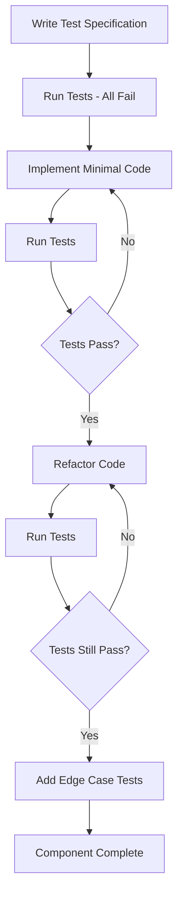

# UI Testing Strategy - Test-Driven Development

## Executive Summary

This document defines the comprehensive TDD strategy for PingToPass UI components. All components MUST have tests written BEFORE implementation, with a target of 100% coverage for critical paths and 85% overall coverage.

## 1. Testing Framework Setup

### 1.1 Required Dependencies

```json
{
  "devDependencies": {
    "@nuxt/test-utils": "^3.19.2",
    "@vue/test-utils": "^2.4.6",
    "@vitest/ui": "^3.2.4",
    "@testing-library/vue": "^8.0.0",
    "@testing-library/user-event": "^14.5.0",
    "@playwright/test": "^1.54.2",
    "vitest": "^3.2.4",
    "happy-dom": "^18.0.1",
    "msw": "^2.0.0",
    "@faker-js/faker": "^8.0.0"
  }
}
```

### 1.2 Test Configuration

```typescript
// vitest.config.ts
import { defineConfig } from 'vitest/config';
import vue from '@vitejs/plugin-vue';
import { resolve } from 'path';

export default defineConfig({
  plugins: [vue()],
  test: {
    globals: true,
    environment: 'happy-dom',
    setupFiles: ['./tests/setup/vitest.setup.ts'],
    coverage: {
      provider: 'v8',
      reporter: ['text', 'json', 'html', 'lcov'],
      exclude: [
        'node_modules/',
        'tests/',
        '*.config.ts',
        '.nuxt/',
        'dist/'
      ],
      thresholds: {
        lines: 85,
        functions: 85,
        branches: 80,
        statements: 85,
        // Critical paths require 100%
        'components/auth/**': {
          lines: 100,
          functions: 100,
          branches: 100,
          statements: 100
        },
        'stores/auth.ts': {
          lines: 100,
          functions: 100,
          branches: 100,
          statements: 100
        }
      }
    }
  },
  resolve: {
    alias: {
      '~': resolve(__dirname, './'),
      '@': resolve(__dirname, './')
    }
  }
});
```

## 2. TDD Workflow for Each Component

### 2.1 Component Development Process



### 2.2 Test File Structure

```
tests/
├── unit/
│   ├── components/
│   │   ├── base/
│   │   │   ├── BaseButton.test.ts
│   │   │   ├── BaseCard.test.ts
│   │   │   ├── BaseModal.test.ts
│   │   │   └── BaseToast.test.ts
│   │   ├── auth/
│   │   │   ├── LoginForm.test.ts
│   │   │   ├── RegisterForm.test.ts
│   │   │   └── AuthGuard.test.ts
│   │   ├── exam/
│   │   │   ├── ExamCard.test.ts
│   │   │   ├── QuestionCard.test.ts
│   │   │   └── AnswerOptions.test.ts
│   │   └── study/
│   │       ├── StudySession.test.ts
│   │       └── ProgressDashboard.test.ts
│   ├── stores/
│   │   ├── auth.test.ts
│   │   ├── exam.test.ts
│   │   └── study.test.ts
│   └── composables/
│       ├── useAuth.test.ts
│       ├── useTimer.test.ts
│       └── useToast.test.ts
├── integration/
│   ├── auth-flow.test.ts
│   ├── study-session.test.ts
│   └── exam-completion.test.ts
├── e2e/
│   ├── complete-exam.spec.ts
│   ├── user-registration.spec.ts
│   └── subscription-upgrade.spec.ts
└── fixtures/
    ├── users.ts
    ├── exams.ts
    └── questions.ts
```

## 3. Test Specifications by Component

### 3.1 Phase 1: Foundation Layer Tests

#### AppLayout.vue Test Specification

```typescript
// tests/unit/components/layout/AppLayout.test.ts
import { describe, it, expect, beforeEach, vi } from 'vitest';
import { mount } from '@vue/test-utils';
import { createTestingPinia } from '@pinia/testing';
import AppLayout from '~/components/layout/AppLayout.vue';

describe('AppLayout', () => {
  let wrapper;
  
  beforeEach(() => {
    wrapper = mount(AppLayout, {
      global: {
        plugins: [createTestingPinia()],
        stubs: {
          NuxtPage: true,
          AppHeader: true,
          AppFooter: true,
          AppNavigation: true
        }
      }
    });
  });
  
  describe('Rendering', () => {
    it('should render header, navigation, content area, and footer', () => {
      expect(wrapper.find('[data-test="app-header"]').exists()).toBe(true);
      expect(wrapper.find('[data-test="app-navigation"]').exists()).toBe(true);
      expect(wrapper.find('[data-test="content-area"]').exists()).toBe(true);
      expect(wrapper.find('[data-test="app-footer"]').exists()).toBe(true);
    });
    
    it('should apply correct layout classes for mobile', async () => {
      window.innerWidth = 375;
      window.dispatchEvent(new Event('resize'));
      await wrapper.vm.$nextTick();
      
      expect(wrapper.find('[data-test="app-layout"]').classes()).toContain('mobile-layout');
    });
    
    it('should apply correct layout classes for desktop', async () => {
      window.innerWidth = 1920;
      window.dispatchEvent(new Event('resize'));
      await wrapper.vm.$nextTick();
      
      expect(wrapper.find('[data-test="app-layout"]').classes()).toContain('desktop-layout');
    });
  });
  
  describe('Navigation Toggle', () => {
    it('should toggle navigation visibility on mobile', async () => {
      window.innerWidth = 375;
      await wrapper.vm.$nextTick();
      
      const nav = wrapper.find('[data-test="app-navigation"]');
      expect(nav.isVisible()).toBe(false);
      
      await wrapper.find('[data-test="nav-toggle"]').trigger('click');
      expect(nav.isVisible()).toBe(true);
      
      await wrapper.find('[data-test="nav-toggle"]').trigger('click');
      expect(nav.isVisible()).toBe(false);
    });
  });
  
  describe('Scroll Behavior', () => {
    it('should add sticky header class on scroll', async () => {
      window.pageYOffset = 100;
      window.dispatchEvent(new Event('scroll'));
      await wrapper.vm.$nextTick();
      
      expect(wrapper.find('[data-test="app-header"]').classes()).toContain('sticky');
    });
  });
  
  describe('Accessibility', () => {
    it('should have correct ARIA landmarks', () => {
      expect(wrapper.find('header[role="banner"]').exists()).toBe(true);
      expect(wrapper.find('nav[role="navigation"]').exists()).toBe(true);
      expect(wrapper.find('main[role="main"]').exists()).toBe(true);
      expect(wrapper.find('footer[role="contentinfo"]').exists()).toBe(true);
    });
    
    it('should have skip navigation link', () => {
      const skipLink = wrapper.find('[data-test="skip-nav"]');
      expect(skipLink.exists()).toBe(true);
      expect(skipLink.attributes('href')).toBe('#main-content');
    });
  });
});
```

### 3.2 Phase 2: Authentication Layer Tests

#### LoginForm.vue Test Specification

```typescript
// tests/unit/components/auth/LoginForm.test.ts
import { describe, it, expect, beforeEach, vi } from 'vitest';
import { mount } from '@vue/test-utils';
import { createTestingPinia } from '@pinia/testing';
import userEvent from '@testing-library/user-event';
import LoginForm from '~/components/auth/LoginForm.vue';
import { useAuthStore } from '~/stores/auth';

describe('LoginForm', () => {
  let wrapper;
  let authStore;
  let user;
  
  beforeEach(() => {
    user = userEvent.setup();
    wrapper = mount(LoginForm, {
      global: {
        plugins: [createTestingPinia({
          createSpy: vi.fn
        })]
      }
    });
    authStore = useAuthStore();
  });
  
  describe('Google OAuth Flow', () => {
    it('should initiate Google OAuth on button click', async () => {
      const googleButton = wrapper.find('[data-test="google-login"]');
      expect(googleButton.exists()).toBe(true);
      
      await googleButton.trigger('click');
      
      expect(authStore.loginWithGoogle).toHaveBeenCalled();
    });
    
    it('should show loading state during authentication', async () => {
      authStore.isLoading = true;
      await wrapper.vm.$nextTick();
      
      expect(wrapper.find('[data-test="loading-spinner"]').exists()).toBe(true);
      expect(wrapper.find('[data-test="google-login"]').attributes('disabled')).toBeDefined();
    });
    
    it('should handle OAuth errors gracefully', async () => {
      authStore.loginWithGoogle.mockRejectedValue(new Error('OAuth failed'));
      
      await wrapper.find('[data-test="google-login"]').trigger('click');
      await wrapper.vm.$nextTick();
      
      expect(wrapper.find('[data-test="error-message"]').text()).toContain('OAuth failed');
    });
  });
  
  describe('Form Validation', () => {
    it('should validate email format', async () => {
      const emailInput = wrapper.find('[data-test="email-input"]');
      
      await user.type(emailInput.element, 'invalid-email');
      await wrapper.find('form').trigger('submit');
      
      expect(wrapper.find('[data-test="email-error"]').text()).toContain('valid email');
    });
    
    it('should require password minimum length', async () => {
      const passwordInput = wrapper.find('[data-test="password-input"]');
      
      await user.type(passwordInput.element, '123');
      await wrapper.find('form').trigger('submit');
      
      expect(wrapper.find('[data-test="password-error"]').text()).toContain('at least 8 characters');
    });
  });
  
  describe('Accessibility', () => {
    it('should have proper form labels', () => {
      expect(wrapper.find('label[for="email"]').exists()).toBe(true);
      expect(wrapper.find('label[for="password"]').exists()).toBe(true);
    });
    
    it('should announce errors to screen readers', async () => {
      await wrapper.find('form').trigger('submit');
      
      const errorRegion = wrapper.find('[role="alert"]');
      expect(errorRegion.exists()).toBe(true);
      expect(errorRegion.attributes('aria-live')).toBe('polite');
    });
    
    it('should support keyboard navigation', async () => {
      const form = wrapper.find('form');
      
      // Tab through form elements
      await user.tab();
      expect(document.activeElement).toBe(wrapper.find('[data-test="email-input"]').element);
      
      await user.tab();
      expect(document.activeElement).toBe(wrapper.find('[data-test="password-input"]').element);
      
      await user.tab();
      expect(document.activeElement).toBe(wrapper.find('[data-test="submit-button"]').element);
    });
  });
  
  describe('Security', () => {
    it('should not store password in plain text', () => {
      const passwordInput = wrapper.find('[data-test="password-input"]');
      expect(passwordInput.attributes('type')).toBe('password');
    });
    
    it('should implement CSRF protection', () => {
      const csrfToken = wrapper.find('[name="csrf_token"]');
      expect(csrfToken.exists()).toBe(true);
    });
    
    it('should rate limit login attempts', async () => {
      // Simulate 5 failed attempts
      for (let i = 0; i < 5; i++) {
        authStore.loginWithGoogle.mockRejectedValue(new Error('Invalid credentials'));
        await wrapper.find('[data-test="google-login"]').trigger('click');
      }
      
      await wrapper.vm.$nextTick();
      expect(wrapper.find('[data-test="rate-limit-error"]').exists()).toBe(true);
    });
  });
});
```

### 3.3 Phase 3: Base Components Tests

#### BaseButton.vue Test Specification

```typescript
// tests/unit/components/base/BaseButton.test.ts
import { describe, it, expect, beforeEach } from 'vitest';
import { mount } from '@vue/test-utils';
import BaseButton from '~/components/base/BaseButton.vue';

describe('BaseButton', () => {
  describe('Props Validation', () => {
    it.each([
      ['variant', 'primary', 'bg-primary-600'],
      ['variant', 'secondary', 'bg-gray-200'],
      ['variant', 'ghost', 'bg-transparent'],
      ['variant', 'danger', 'bg-error-600'],
      ['size', 'sm', 'px-3'],
      ['size', 'md', 'px-4'],
      ['size', 'lg', 'px-6']
    ])('should apply correct classes for %s=%s', async (prop, value, expectedClass) => {
      const wrapper = mount(BaseButton, {
        props: { [prop]: value }
      });
      
      expect(wrapper.classes()).toContain(expectedClass);
    });
    
    it('should handle loading state', async () => {
      const wrapper = mount(BaseButton, {
        props: { loading: true }
      });
      
      expect(wrapper.find('.animate-spin').exists()).toBe(true);
      expect(wrapper.attributes('disabled')).toBeDefined();
      expect(wrapper.attributes('aria-busy')).toBe('true');
    });
    
    it('should handle disabled state', () => {
      const wrapper = mount(BaseButton, {
        props: { disabled: true }
      });
      
      expect(wrapper.attributes('disabled')).toBeDefined();
      expect(wrapper.classes()).toContain('disabled:opacity-50');
    });
    
    it('should handle full width', () => {
      const wrapper = mount(BaseButton, {
        props: { fullWidth: true }
      });
      
      expect(wrapper.classes()).toContain('w-full');
    });
  });
  
  describe('Icon Support', () => {
    it('should render icon on the left', () => {
      const wrapper = mount(BaseButton, {
        props: {
          icon: 'i-lucide-plus',
          iconPosition: 'left'
        },
        slots: {
          default: 'Add Item'
        }
      });
      
      const icon = wrapper.find('.i-lucide-plus');
      expect(icon.exists()).toBe(true);
      expect(wrapper.text()).toBe('Add Item');
    });
    
    it('should render icon on the right', () => {
      const wrapper = mount(BaseButton, {
        props: {
          icon: 'i-lucide-arrow-right',
          iconPosition: 'right'
        },
        slots: {
          default: 'Next'
        }
      });
      
      const elements = wrapper.findAll('span');
      expect(elements[elements.length - 1].classes()).toContain('i-lucide-arrow-right');
    });
  });
  
  describe('Events', () => {
    it('should emit click event when not disabled', async () => {
      const wrapper = mount(BaseButton);
      
      await wrapper.trigger('click');
      
      expect(wrapper.emitted('click')).toHaveLength(1);
    });
    
    it('should not emit click event when disabled', async () => {
      const wrapper = mount(BaseButton, {
        props: { disabled: true }
      });
      
      await wrapper.trigger('click', { force: true });
      
      expect(wrapper.emitted('click')).toBeUndefined();
    });
    
    it('should not emit click event when loading', async () => {
      const wrapper = mount(BaseButton, {
        props: { loading: true }
      });
      
      await wrapper.trigger('click', { force: true });
      
      expect(wrapper.emitted('click')).toBeUndefined();
    });
  });
  
  describe('Accessibility', () => {
    it('should have correct type attribute', () => {
      const wrapper = mount(BaseButton, {
        props: { type: 'submit' }
      });
      
      expect(wrapper.attributes('type')).toBe('submit');
    });
    
    it('should support aria-label', () => {
      const wrapper = mount(BaseButton, {
        attrs: {
          'aria-label': 'Save document'
        }
      });
      
      expect(wrapper.attributes('aria-label')).toBe('Save document');
    });
    
    it('should be keyboard accessible', async () => {
      const wrapper = mount(BaseButton);
      
      await wrapper.trigger('keydown.enter');
      expect(wrapper.emitted('click')).toHaveLength(1);
      
      await wrapper.trigger('keydown.space');
      expect(wrapper.emitted('click')).toHaveLength(2);
    });
  });
  
  describe('Performance', () => {
    it('should render within 16ms', () => {
      const start = performance.now();
      mount(BaseButton);
      const end = performance.now();
      
      expect(end - start).toBeLessThan(16);
    });
    
    it('should not cause unnecessary re-renders', async () => {
      const wrapper = mount(BaseButton);
      const renderSpy = vi.spyOn(wrapper.vm, 'render');
      
      // Trigger a prop that shouldn't cause re-render
      await wrapper.setProps({ 'data-test': 'button' });
      
      expect(renderSpy).not.toHaveBeenCalled();
    });
  });
});
```

### 3.4 Phase 4: Exam Components Tests

#### QuestionCard.vue Test Specification

```typescript
// tests/unit/components/exam/QuestionCard.test.ts
import { describe, it, expect, beforeEach, vi } from 'vitest';
import { mount } from '@vue/test-utils';
import QuestionCard from '~/components/exam/QuestionCard.vue';
import { mockQuestion } from '~/tests/fixtures/questions';

describe('QuestionCard', () => {
  let wrapper;
  let question;
  
  beforeEach(() => {
    question = mockQuestion();
    wrapper = mount(QuestionCard, {
      props: {
        question,
        questionNumber: 1,
        totalQuestions: 10
      }
    });
  });
  
  describe('Question Display', () => {
    it('should display question text', () => {
      expect(wrapper.find('[data-test="question-text"]').text()).toContain(question.text);
    });
    
    it('should display question number and total', () => {
      const header = wrapper.find('[data-test="question-header"]');
      expect(header.text()).toContain('Question 1 of 10');
    });
    
    it('should display difficulty indicator', () => {
      const difficulty = wrapper.find('[data-test="difficulty-indicator"]');
      expect(difficulty.exists()).toBe(true);
      expect(difficulty.attributes('aria-label')).toContain(`Difficulty: ${question.difficulty}`);
    });
    
    it('should render markdown in question text', () => {
      const codeQuestion = mockQuestion({
        text: 'What does `console.log()` do?'
      });
      
      wrapper = mount(QuestionCard, {
        props: { question: codeQuestion }
      });
      
      expect(wrapper.find('code').exists()).toBe(true);
    });
  });
  
  describe('Answer Selection', () => {
    it('should allow single answer selection for single-choice questions', async () => {
      const options = wrapper.findAll('[data-test^="answer-option-"]');
      
      await options[0].trigger('click');
      expect(wrapper.emitted('select')).toHaveLength(1);
      expect(wrapper.emitted('select')[0]).toEqual([[question.options[0].id]]);
      
      await options[1].trigger('click');
      expect(wrapper.emitted('select')).toHaveLength(2);
      expect(wrapper.emitted('select')[1]).toEqual([[question.options[1].id]]);
    });
    
    it('should allow multiple answer selection for multiple-choice questions', async () => {
      question.type = 'multiple';
      wrapper = mount(QuestionCard, {
        props: { question }
      });
      
      const options = wrapper.findAll('[data-test^="answer-option-"]');
      
      await options[0].trigger('click');
      await options[1].trigger('click');
      
      expect(wrapper.emitted('select')).toHaveLength(2);
      expect(wrapper.emitted('select')[1]).toEqual([[
        question.options[0].id,
        question.options[1].id
      ]]);
    });
    
    it('should highlight selected answers', async () => {
      await wrapper.setProps({
        selectedOptions: [question.options[0].id]
      });
      
      const firstOption = wrapper.find('[data-test="answer-option-0"]');
      expect(firstOption.classes()).toContain('selected');
    });
  });
  
  describe('Explanation Display', () => {
    it('should not show explanation by default', () => {
      expect(wrapper.find('[data-test="explanation"]').exists()).toBe(false);
    });
    
    it('should show explanation when prop is true', async () => {
      await wrapper.setProps({ showExplanation: true });
      
      const explanation = wrapper.find('[data-test="explanation"]');
      expect(explanation.exists()).toBe(true);
      expect(explanation.text()).toContain(question.explanation);
    });
    
    it('should highlight correct answers when showing explanation', async () => {
      await wrapper.setProps({ showExplanation: true });
      
      const correctOption = wrapper.find(`[data-test="answer-option-${question.options.findIndex(o => o.isCorrect)}"]`);
      expect(correctOption.classes()).toContain('correct');
    });
  });
  
  describe('Disabled State', () => {
    it('should disable all interactions when disabled', async () => {
      await wrapper.setProps({ disabled: true });
      
      const options = wrapper.findAll('[data-test^="answer-option-"]');
      
      for (const option of options) {
        expect(option.attributes('disabled')).toBeDefined();
      }
      
      await options[0].trigger('click');
      expect(wrapper.emitted('select')).toBeUndefined();
    });
  });
  
  describe('Drag and Drop Questions', () => {
    it('should support drag and drop for matching questions', async () => {
      question.type = 'drag-drop';
      wrapper = mount(QuestionCard, {
        props: { question }
      });
      
      const draggable = wrapper.find('[data-test="draggable-item-0"]');
      const dropZone = wrapper.find('[data-test="drop-zone-0"]');
      
      // Simulate drag
      await draggable.trigger('dragstart');
      await dropZone.trigger('dragover');
      await dropZone.trigger('drop');
      
      expect(wrapper.emitted('select')).toHaveLength(1);
    });
  });
  
  describe('Accessibility', () => {
    it('should have proper ARIA attributes', () => {
      const container = wrapper.find('[data-test="question-card"]');
      expect(container.attributes('role')).toBe('article');
      expect(container.attributes('aria-labelledby')).toBeDefined();
    });
    
    it('should support keyboard navigation', async () => {
      const options = wrapper.findAll('[data-test^="answer-option-"]');
      
      // Focus first option
      options[0].element.focus();
      
      // Navigate with arrow keys
      await wrapper.trigger('keydown.down');
      expect(document.activeElement).toBe(options[1].element);
      
      // Select with space
      await wrapper.trigger('keydown.space');
      expect(wrapper.emitted('select')).toHaveLength(1);
    });
    
    it('should announce changes to screen readers', async () => {
      await wrapper.setProps({
        selectedOptions: [question.options[0].id]
      });
      
      const announcement = wrapper.find('[role="status"]');
      expect(announcement.text()).toContain('Answer A selected');
    });
  });
  
  describe('Performance', () => {
    it('should handle large number of options efficiently', () => {
      const largeQuestion = mockQuestion({
        options: Array.from({ length: 20 }, (_, i) => ({
          id: `opt-${i}`,
          text: `Option ${i}`,
          isCorrect: i === 0
        }))
      });
      
      const start = performance.now();
      mount(QuestionCard, {
        props: { question: largeQuestion }
      });
      const end = performance.now();
      
      expect(end - start).toBeLessThan(50);
    });
  });
});
```

### 3.5 Phase 5: Study Components Tests

#### StudySession.vue Test Specification

```typescript
// tests/unit/components/study/StudySession.test.ts
import { describe, it, expect, beforeEach, vi, afterEach } from 'vitest';
import { mount, flushPromises } from '@vue/test-utils';
import { createTestingPinia } from '@pinia/testing';
import StudySession from '~/components/study/StudySession.vue';
import { useStudyStore } from '~/stores/study';
import { mockExam, mockQuestions } from '~/tests/fixtures';

describe('StudySession', () => {
  let wrapper;
  let studyStore;
  
  beforeEach(() => {
    vi.useFakeTimers();
    
    wrapper = mount(StudySession, {
      props: {
        examId: 'exam-1',
        mode: 'practice'
      },
      global: {
        plugins: [createTestingPinia({
          createSpy: vi.fn,
          initialState: {
            study: {
              session: {
                id: 'session-1',
                examId: 'exam-1',
                questions: mockQuestions(10),
                mode: 'practice'
              },
              currentQuestion: mockQuestions(1)[0],
              questionIndex: 0
            }
          }
        })]
      }
    });
    
    studyStore = useStudyStore();
  });
  
  afterEach(() => {
    vi.useRealTimers();
  });
  
  describe('Session Initialization', () => {
    it('should start session on mount', async () => {
      await flushPromises();
      
      expect(studyStore.startSession).toHaveBeenCalledWith('exam-1', 'practice');
    });
    
    it('should display loading state during initialization', () => {
      studyStore.isLoading = true;
      
      expect(wrapper.find('[data-test="loading-spinner"]').exists()).toBe(true);
    });
    
    it('should handle initialization errors', async () => {
      studyStore.startSession.mockRejectedValue(new Error('Failed to start'));
      
      wrapper = mount(StudySession, {
        props: { examId: 'exam-1', mode: 'practice' }
      });
      
      await flushPromises();
      
      expect(wrapper.find('[data-test="error-message"]').text()).toContain('Failed to start');
    });
  });
  
  describe('Question Navigation', () => {
    it('should navigate to next question', async () => {
      await wrapper.find('[data-test="next-button"]').trigger('click');
      
      expect(studyStore.nextQuestion).toHaveBeenCalled();
    });
    
    it('should navigate to previous question', async () => {
      studyStore.questionIndex = 5;
      await wrapper.vm.$nextTick();
      
      await wrapper.find('[data-test="prev-button"]').trigger('click');
      
      expect(studyStore.previousQuestion).toHaveBeenCalled();
    });
    
    it('should disable previous button on first question', () => {
      studyStore.questionIndex = 0;
      
      const prevButton = wrapper.find('[data-test="prev-button"]');
      expect(prevButton.attributes('disabled')).toBeDefined();
    });
    
    it('should show finish button on last question', async () => {
      studyStore.questionIndex = 9;
      await wrapper.vm.$nextTick();
      
      expect(wrapper.find('[data-test="finish-button"]').exists()).toBe(true);
      expect(wrapper.find('[data-test="next-button"]').exists()).toBe(false);
    });
  });
  
  describe('Answer Submission', () => {
    it('should submit answer and auto-advance in practice mode', async () => {
      const answerOption = wrapper.find('[data-test="answer-option-0"]');
      await answerOption.trigger('click');
      
      expect(studyStore.submitAnswer).toHaveBeenCalledWith(
        studyStore.currentQuestion.id,
        [studyStore.currentQuestion.options[0].id]
      );
      
      // Auto-advance after 2 seconds in practice mode
      vi.advanceTimersByTime(2000);
      expect(studyStore.nextQuestion).toHaveBeenCalled();
    });
    
    it('should not auto-advance in exam mode', async () => {
      await wrapper.setProps({ mode: 'exam' });
      
      const answerOption = wrapper.find('[data-test="answer-option-0"]');
      await answerOption.trigger('click');
      
      vi.advanceTimersByTime(2000);
      expect(studyStore.nextQuestion).not.toHaveBeenCalled();
    });
    
    it('should show immediate feedback in practice mode', async () => {
      await wrapper.find('[data-test="answer-option-0"]').trigger('click');
      
      expect(wrapper.find('[data-test="answer-feedback"]').exists()).toBe(true);
    });
    
    it('should not show feedback in exam mode', async () => {
      await wrapper.setProps({ mode: 'exam' });
      await wrapper.find('[data-test="answer-option-0"]').trigger('click');
      
      expect(wrapper.find('[data-test="answer-feedback"]').exists()).toBe(false);
    });
  });
  
  describe('Timer Functionality', () => {
    it('should display timer for timed mode', async () => {
      await wrapper.setProps({ mode: 'timed' });
      studyStore.timeRemaining = 3600;
      
      await wrapper.vm.$nextTick();
      
      const timer = wrapper.find('[data-test="session-timer"]');
      expect(timer.exists()).toBe(true);
      expect(timer.text()).toContain('60:00');
    });
    
    it('should countdown timer', async () => {
      await wrapper.setProps({ mode: 'timed' });
      studyStore.timeRemaining = 60;
      
      vi.advanceTimersByTime(1000);
      await wrapper.vm.$nextTick();
      
      expect(wrapper.find('[data-test="session-timer"]').text()).toContain('0:59');
    });
    
    it('should show warning when time is low', async () => {
      await wrapper.setProps({ mode: 'timed' });
      studyStore.timeRemaining = 300; // 5 minutes
      
      await wrapper.vm.$nextTick();
      
      expect(wrapper.find('[data-test="timer-warning"]').exists()).toBe(true);
    });
    
    it('should auto-submit when time expires', async () => {
      await wrapper.setProps({ mode: 'timed' });
      studyStore.timeRemaining = 1;
      
      vi.advanceTimersByTime(1000);
      await wrapper.vm.$nextTick();
      
      expect(studyStore.completeSession).toHaveBeenCalled();
    });
  });
  
  describe('Progress Tracking', () => {
    it('should display progress bar', () => {
      const progressBar = wrapper.find('[data-test="progress-bar"]');
      expect(progressBar.exists()).toBe(true);
      expect(progressBar.attributes('aria-valuenow')).toBe('10'); // 1 of 10 = 10%
    });
    
    it('should update progress as questions are answered', async () => {
      studyStore.questionIndex = 4;
      await wrapper.vm.$nextTick();
      
      const progressBar = wrapper.find('[data-test="progress-bar"]');
      expect(progressBar.attributes('aria-valuenow')).toBe('50'); // 5 of 10 = 50%
    });
    
    it('should display question counter', () => {
      const counter = wrapper.find('[data-test="question-counter"]');
      expect(counter.text()).toContain('1 / 10');
    });
  });
  
  describe('Session Controls', () => {
    it('should pause session', async () => {
      await wrapper.find('[data-test="pause-button"]').trigger('click');
      
      expect(studyStore.pauseSession).toHaveBeenCalled();
      expect(wrapper.find('[data-test="paused-overlay"]').exists()).toBe(true);
    });
    
    it('should resume session', async () => {
      studyStore.isPaused = true;
      await wrapper.vm.$nextTick();
      
      await wrapper.find('[data-test="resume-button"]').trigger('click');
      
      expect(studyStore.resumeSession).toHaveBeenCalled();
    });
    
    it('should confirm before ending session', async () => {
      await wrapper.find('[data-test="end-session"]').trigger('click');
      
      const modal = wrapper.find('[data-test="confirm-modal"]');
      expect(modal.exists()).toBe(true);
      
      await modal.find('[data-test="confirm-end"]').trigger('click');
      expect(studyStore.endSession).toHaveBeenCalled();
    });
  });
  
  describe('Keyboard Shortcuts', () => {
    it('should support keyboard navigation', async () => {
      // Next question: Arrow Right
      await wrapper.trigger('keydown.right');
      expect(studyStore.nextQuestion).toHaveBeenCalled();
      
      // Previous question: Arrow Left
      studyStore.questionIndex = 5;
      await wrapper.trigger('keydown.left');
      expect(studyStore.previousQuestion).toHaveBeenCalled();
      
      // Select answer: Number keys
      await wrapper.trigger('keydown', { key: '1' });
      expect(studyStore.submitAnswer).toHaveBeenCalled();
      
      // Pause: Space
      await wrapper.trigger('keydown.space');
      expect(studyStore.pauseSession).toHaveBeenCalled();
    });
  });
  
  describe('Accessibility', () => {
    it('should announce question changes', async () => {
      studyStore.questionIndex = 1;
      await wrapper.vm.$nextTick();
      
      const announcement = wrapper.find('[role="status"]');
      expect(announcement.text()).toContain('Question 2 of 10');
    });
    
    it('should have proper focus management', async () => {
      await studyStore.nextQuestion();
      await wrapper.vm.$nextTick();
      
      // Focus should move to question text
      expect(document.activeElement).toBe(
        wrapper.find('[data-test="question-text"]').element
      );
    });
  });
  
  describe('Performance', () => {
    it('should handle rapid navigation', async () => {
      const start = performance.now();
      
      for (let i = 0; i < 10; i++) {
        await wrapper.find('[data-test="next-button"]').trigger('click');
      }
      
      const end = performance.now();
      expect(end - start).toBeLessThan(500);
    });
    
    it('should lazy load explanations', () => {
      // Explanations should not be in DOM until requested
      expect(wrapper.find('[data-test="explanation"]').exists()).toBe(false);
      
      // Should load on demand
      wrapper.find('[data-test="show-explanation"]').trigger('click');
      expect(wrapper.find('[data-test="explanation"]').exists()).toBe(true);
    });
  });
});
```

## 4. Test Fixtures and Factories

### 4.1 User Fixtures

```typescript
// tests/fixtures/users.ts
import { faker } from '@faker-js/faker';
import type { User } from '~/types';

export const createUser = (overrides?: Partial<User>): User => ({
  id: faker.string.uuid(),
  email: faker.internet.email(),
  name: faker.person.fullName(),
  googleId: faker.string.uuid(),
  stripeCustomerId: `cus_${faker.string.alphanumeric(14)}`,
  subscriptionTier: 'free',
  createdAt: faker.date.past(),
  updatedAt: faker.date.recent(),
  ...overrides
});

export const createAuthenticatedUser = (): User => createUser({
  subscriptionTier: 'pro'
});

export const createAdminUser = (): User => createUser({
  email: 'admin@pingtopass.com',
  subscriptionTier: 'enterprise'
});
```

### 4.2 Question Fixtures

```typescript
// tests/fixtures/questions.ts
import { faker } from '@faker-js/faker';
import type { Question, AnswerOption } from '~/types';

export const createAnswerOption = (overrides?: Partial<AnswerOption>): AnswerOption => ({
  id: faker.string.uuid(),
  text: faker.lorem.sentence(),
  isCorrect: false,
  order: faker.number.int({ min: 0, max: 5 }),
  ...overrides
});

export const createQuestion = (overrides?: Partial<Question>): Question => {
  const options = [
    createAnswerOption({ order: 0, isCorrect: true }),
    createAnswerOption({ order: 1 }),
    createAnswerOption({ order: 2 }),
    createAnswerOption({ order: 3 })
  ];
  
  return {
    id: faker.string.uuid(),
    examId: faker.string.uuid(),
    type: 'single',
    text: faker.lorem.paragraph(),
    explanation: faker.lorem.paragraphs(2),
    difficulty: faker.number.int({ min: 1, max: 5 }) as 1 | 2 | 3 | 4 | 5,
    objectiveId: faker.string.uuid(),
    options,
    isActive: true,
    aiGenerated: faker.datatype.boolean(),
    ...overrides
  };
};

export const mockQuestion = createQuestion;
export const mockQuestions = (count: number) => 
  Array.from({ length: count }, () => createQuestion());
```

## 5. Integration Test Patterns

### 5.1 API Mocking with MSW

```typescript
// tests/mocks/handlers.ts
import { http, HttpResponse } from 'msw';
import { createUser, createQuestion } from '~/tests/fixtures';

export const handlers = [
  // Auth endpoints
  http.post('/api/auth/google', async ({ request }) => {
    const body = await request.json();
    
    if (body.code === 'invalid') {
      return HttpResponse.json(
        { error: 'Invalid OAuth code' },
        { status: 401 }
      );
    }
    
    return HttpResponse.json({
      token: 'mock-jwt-token',
      user: createUser()
    });
  }),
  
  // Exam endpoints
  http.get('/api/exams/:id', ({ params }) => {
    return HttpResponse.json({
      id: params.id,
      name: 'Test Exam',
      questionCount: 100
    });
  }),
  
  // Question endpoints
  http.get('/api/questions', ({ request }) => {
    const url = new URL(request.url);
    const limit = parseInt(url.searchParams.get('limit') || '10');
    
    return HttpResponse.json({
      questions: mockQuestions(limit),
      total: 100
    });
  })
];

// Setup MSW
import { setupServer } from 'msw/node';
export const server = setupServer(...handlers);
```

## 6. E2E Test Patterns

### 6.1 Page Object Model

```typescript
// tests/e2e/pages/LoginPage.ts
import { Page, Locator } from '@playwright/test';

export class LoginPage {
  readonly page: Page;
  readonly googleButton: Locator;
  readonly emailInput: Locator;
  readonly passwordInput: Locator;
  readonly submitButton: Locator;
  readonly errorMessage: Locator;
  
  constructor(page: Page) {
    this.page = page;
    this.googleButton = page.getByTestId('google-login');
    this.emailInput = page.getByTestId('email-input');
    this.passwordInput = page.getByTestId('password-input');
    this.submitButton = page.getByTestId('submit-button');
    this.errorMessage = page.getByTestId('error-message');
  }
  
  async goto() {
    await this.page.goto('/auth/login');
  }
  
  async loginWithGoogle() {
    await this.googleButton.click();
  }
  
  async loginWithCredentials(email: string, password: string) {
    await this.emailInput.fill(email);
    await this.passwordInput.fill(password);
    await this.submitButton.click();
  }
  
  async expectError(message: string) {
    await expect(this.errorMessage).toContainText(message);
  }
}
```

## 7. Performance Testing

### 7.1 Component Render Performance

```typescript
// tests/performance/component-perf.test.ts
import { describe, it, expect } from 'vitest';
import { mount } from '@vue/test-utils';
import { performance } from 'perf_hooks';

describe('Component Performance', () => {
  it('should render QuestionCard under 16ms', () => {
    const measurements = [];
    
    for (let i = 0; i < 100; i++) {
      const start = performance.now();
      mount(QuestionCard, {
        props: { question: mockQuestion() }
      });
      const end = performance.now();
      measurements.push(end - start);
    }
    
    const average = measurements.reduce((a, b) => a + b) / measurements.length;
    const p95 = measurements.sort()[95];
    
    expect(average).toBeLessThan(16);
    expect(p95).toBeLessThan(20);
  });
});
```

## 8. Coverage Requirements

### 8.1 Coverage by Component Type

| Component Type | Line Coverage | Branch Coverage | Function Coverage |
|---------------|---------------|-----------------|-------------------|
| Auth Components | 100% | 100% | 100% |
| Payment Components | 100% | 100% | 100% |
| Base Components | 90% | 85% | 90% |
| Exam Components | 90% | 85% | 90% |
| Study Components | 95% | 90% | 95% |
| Layout Components | 80% | 75% | 80% |
| Utility Functions | 100% | 100% | 100% |
| Store Actions | 100% | 95% | 100% |
| API Handlers | 95% | 90% | 95% |

### 8.2 Critical Path Coverage

All critical user paths MUST have 100% coverage:
- User registration and login
- Payment processing
- Exam completion
- Score calculation
- Progress tracking

## 9. Testing Commands

```bash
# Run all tests
npm run test

# Run unit tests only
npm run test:unit

# Run integration tests
npm run test:integration

# Run E2E tests
npm run test:e2e

# Run with coverage
npm run test:coverage

# Watch mode for TDD
npm run test:watch

# Run specific test file
npm run test QuestionCard.test.ts

# Run tests matching pattern
npm run test --grep "should display"

# Update snapshots
npm run test:unit -- -u

# Debug tests
npm run test:debug
```

## 10. CI/CD Integration

```yaml
# .github/workflows/test.yml
name: Test Suite

on: [push, pull_request]

jobs:
  test:
    runs-on: ubuntu-latest
    
    steps:
      - uses: actions/checkout@v3
      
      - name: Setup Node
        uses: actions/setup-node@v3
        with:
          node-version: '20'
          
      - name: Install dependencies
        run: npm ci
        
      - name: Run unit tests
        run: npm run test:unit -- --coverage
        
      - name: Run integration tests
        run: npm run test:integration
        
      - name: Install Playwright browsers
        run: npx playwright install --with-deps
        
      - name: Run E2E tests
        run: npm run test:e2e
        
      - name: Upload coverage
        uses: codecov/codecov-action@v3
        with:
          files: ./coverage/lcov.info
          
      - name: Check coverage thresholds
        run: npm run test:coverage:check
```

## Conclusion

This comprehensive testing strategy ensures:

1. **100% test coverage** for critical paths
2. **TDD workflow** enforced for all components
3. **Performance benchmarks** for user interactions
4. **Accessibility compliance** through automated testing
5. **Regression prevention** through comprehensive test suites

All tests MUST be written BEFORE implementation to ensure proper TDD methodology.