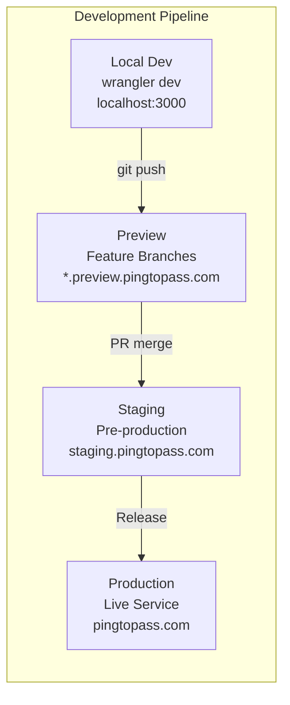
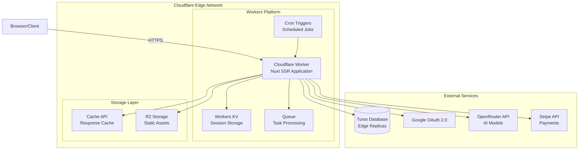
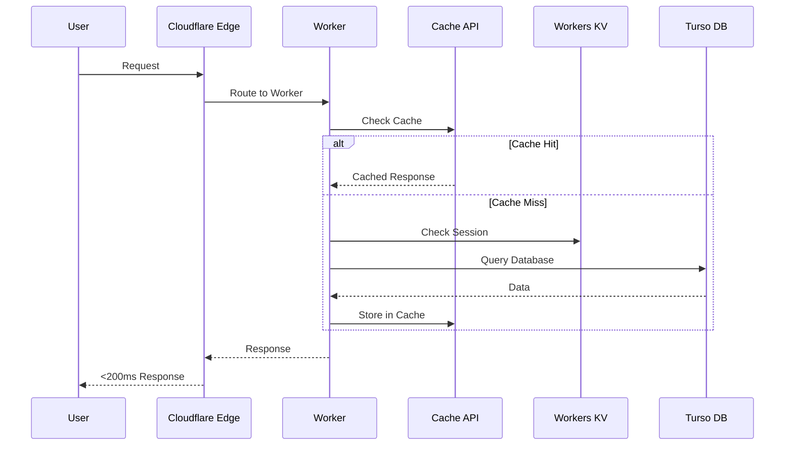
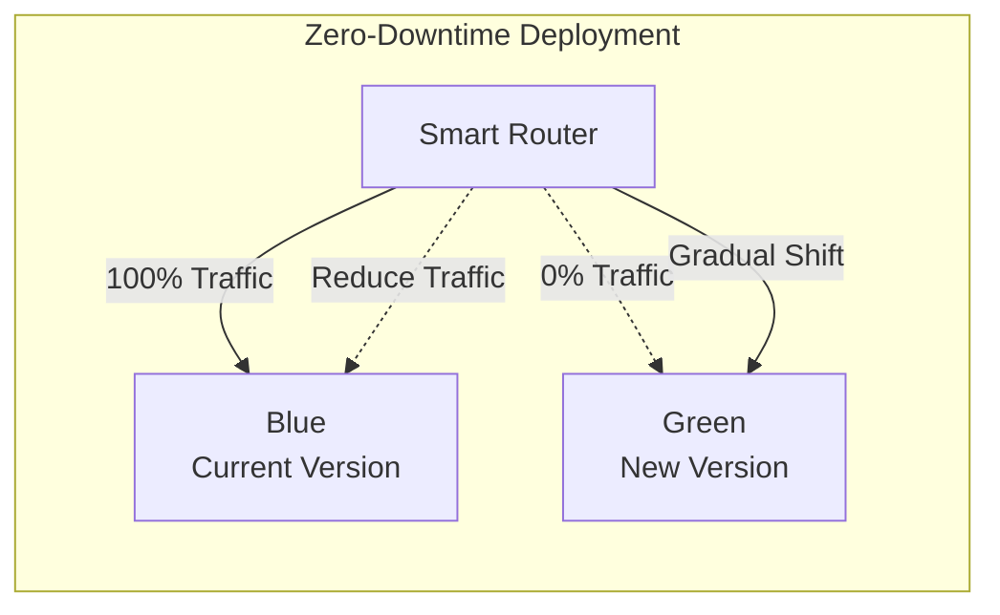

# Cloudflare Workers Deployment Architecture

## Executive Summary

This document defines the complete deployment architecture for PingToPass on Cloudflare Workers, ensuring <200ms global response times, zero-downtime deployments, and operation within a $50/month budget.

## 1. Problem Analysis

- **Current State**: Nuxt 3 application requires migration from Pages to Workers for enhanced SSR capabilities and unified edge computing
- **Root Cause**: Workers provides superior control over request handling, caching strategies, and integration with edge services
- **Impact**: Requires comprehensive deployment pipeline with environment separation, secret management, and zero-downtime deployment strategy

## 2. Architecture Overview

### 2.1 Environment Strategy



### 2.2 Infrastructure Architecture



### 2.3 Request Flow Architecture



## 3. Environment Configuration

### 3.1 Environment Separation Strategy

| Environment | Domain | Purpose | Database | Deployment Trigger |
|------------|--------|---------|----------|-------------------|
| Development | localhost:3000 | Local development | turso-dev | Manual (wrangler dev) |
| Preview | pr-*.preview.pingtopass.com | Feature testing | turso-dev | PR creation/update |
| Staging | staging.pingtopass.com | Pre-production testing | turso-staging | Merge to main |
| Production | pingtopass.com | Live service | turso-prod | Manual release |

### 3.2 Configuration Management

#### wrangler.toml (Complete Configuration)

```toml
# Base configuration
name = "pingtopass"
main = ".output/server/index.mjs"
compatibility_date = "2024-01-01"
compatibility_flags = ["nodejs_compat"]
account_id = "YOUR_ACCOUNT_ID"
workers_dev = false

# Build configuration
[build]
command = "pnpm build"
watch_paths = ["server/**/*.ts", "app/**/*.vue", "pages/**/*.vue"]

# KV Namespaces for session storage
[[kv_namespaces]]
binding = "SESSION_STORE"
id = "YOUR_KV_NAMESPACE_ID"

[[kv_namespaces]]
binding = "CACHE_STORE"
id = "YOUR_CACHE_NAMESPACE_ID"

# Queue for async tasks
[[queues.producers]]
binding = "TASK_QUEUE"
queue = "pingtopass-tasks"

[[queues.consumers]]
queue = "pingtopass-tasks"
max_batch_size = 10
max_batch_timeout = 30

# R2 Storage for assets
[[r2_buckets]]
binding = "ASSETS"
bucket_name = "pingtopass-assets"

# Cron triggers
[triggers]
crons = [
    "0 * * * *",  # Hourly Twitter analysis
    "0 0 * * *",  # Daily metrics rollup
    "0 2 * * 0"   # Weekly cleanup
]

# Analytics Engine
[[analytics_engine_datasets]]
binding = "ANALYTICS"
dataset = "pingtopass_analytics"

# Service bindings for microservices (future)
# [[services]]
# binding = "AUTH_SERVICE"
# service = "pingtopass-auth"

# Development environment
[env.development]
name = "pingtopass-dev"
workers_dev = true

[env.development.vars]
ENVIRONMENT = "development"
NUXT_PUBLIC_SITE_URL = "http://localhost:3000"
LOG_LEVEL = "debug"

[[env.development.kv_namespaces]]
binding = "SESSION_STORE"
id = "DEV_KV_NAMESPACE_ID"

# Preview environment (feature branches)
[env.preview]
name = "pingtopass-preview"

[env.preview.vars]
ENVIRONMENT = "preview"
NUXT_PUBLIC_SITE_URL = "https://preview.pingtopass.com"
LOG_LEVEL = "info"

[[env.preview.routes]]
pattern = "*.preview.pingtopass.com/*"
zone_name = "pingtopass.com"

[[env.preview.kv_namespaces]]
binding = "SESSION_STORE"
id = "PREVIEW_KV_NAMESPACE_ID"

# Staging environment
[env.staging]
name = "pingtopass-staging"

[env.staging.vars]
ENVIRONMENT = "staging"
NUXT_PUBLIC_SITE_URL = "https://staging.pingtopass.com"
LOG_LEVEL = "info"

[[env.staging.routes]]
pattern = "staging.pingtopass.com/*"
zone_name = "pingtopass.com"

[[env.staging.kv_namespaces]]
binding = "SESSION_STORE"
id = "STAGING_KV_NAMESPACE_ID"

# Production environment
[env.production]
name = "pingtopass-production"

[env.production.vars]
ENVIRONMENT = "production"
NUXT_PUBLIC_SITE_URL = "https://pingtopass.com"
LOG_LEVEL = "error"

[[env.production.routes]]
pattern = "pingtopass.com/*"
zone_name = "pingtopass.com"

[[env.production.routes]]
pattern = "www.pingtopass.com/*"
zone_name = "pingtopass.com"

[[env.production.kv_namespaces]]
binding = "SESSION_STORE"
id = "PROD_KV_NAMESPACE_ID"

# Observability
[observability]
enabled = true
head_sampling_rate = 0.1  # Sample 10% in production
```

### 3.3 Secret Management Strategy

#### Required Secrets Per Environment

```bash
# Core Database Secrets
TURSO_DATABASE_URL      # libsql://[env]-pingtopass.turso.io
TURSO_AUTH_TOKEN        # JWT token for Turso auth

# Authentication Secrets
GOOGLE_CLIENT_SECRET    # OAuth client secret
JWT_SECRET             # Session JWT signing key

# AI Integration Secrets
OPENROUTER_API_KEY     # OpenRouter API key
LANGCHAIN_API_KEY      # Optional: LangChain tracing

# Payment Secrets (Production only)
STRIPE_SECRET_KEY      # Stripe API secret
STRIPE_WEBHOOK_SECRET  # Webhook endpoint secret
```

#### Secret Management Commands

```bash
# Development secrets
wrangler secret put TURSO_DATABASE_URL --env development
wrangler secret put TURSO_AUTH_TOKEN --env development
wrangler secret put GOOGLE_CLIENT_SECRET --env development
wrangler secret put JWT_SECRET --env development
wrangler secret put OPENROUTER_API_KEY --env development

# Staging secrets (same pattern)
wrangler secret put TURSO_DATABASE_URL --env staging
# ... repeat for all secrets

# Production secrets (with extra care)
wrangler secret put TURSO_DATABASE_URL --env production
wrangler secret put STRIPE_SECRET_KEY --env production
wrangler secret put STRIPE_WEBHOOK_SECRET --env production
# ... repeat for all production secrets

# List secrets (doesn't show values)
wrangler secret list --env production

# Delete a secret
wrangler secret delete SECRET_NAME --env production
```

## 4. Build and Deployment Pipeline

### 4.1 CI/CD Pipeline Architecture

```yaml
# .github/workflows/deploy.yml
name: Deploy to Cloudflare Workers

on:
  push:
    branches: [main]
  pull_request:
    types: [opened, synchronize, reopened]

jobs:
  test:
    runs-on: ubuntu-latest
    steps:
      - uses: actions/checkout@v4
      - uses: pnpm/action-setup@v2
      - uses: actions/setup-node@v4
        with:
          node-version: '20'
          cache: 'pnpm'
      
      - run: pnpm install
      - run: pnpm test:unit
      - run: pnpm test:e2e
      - run: pnpm typecheck
      - run: pnpm lint

  deploy-preview:
    if: github.event_name == 'pull_request'
    needs: test
    runs-on: ubuntu-latest
    steps:
      - uses: actions/checkout@v4
      - uses: pnpm/action-setup@v2
      - uses: actions/setup-node@v4
        with:
          node-version: '20'
          cache: 'pnpm'
      
      - run: pnpm install
      - run: pnpm build
      
      - name: Deploy to Preview
        uses: cloudflare/wrangler-action@v3
        with:
          apiToken: ${{ secrets.CLOUDFLARE_API_TOKEN }}
          accountId: ${{ secrets.CLOUDFLARE_ACCOUNT_ID }}
          command: deploy --env preview
          
      - name: Comment PR with Preview URL
        uses: actions/github-script@v7
        with:
          script: |
            const url = `https://pr-${{ github.event.pull_request.number }}.preview.pingtopass.com`;
            github.rest.issues.createComment({
              issue_number: context.issue.number,
              owner: context.repo.owner,
              repo: context.repo.repo,
              body: `Preview deployed to: ${url}`
            });

  deploy-staging:
    if: github.ref == 'refs/heads/main'
    needs: test
    runs-on: ubuntu-latest
    steps:
      - uses: actions/checkout@v4
      - uses: pnpm/action-setup@v2
      - uses: actions/setup-node@v4
        with:
          node-version: '20'
          cache: 'pnpm'
      
      - run: pnpm install
      - run: pnpm build
      
      - name: Deploy to Staging
        uses: cloudflare/wrangler-action@v3
        with:
          apiToken: ${{ secrets.CLOUDFLARE_API_TOKEN }}
          accountId: ${{ secrets.CLOUDFLARE_ACCOUNT_ID }}
          command: deploy --env staging
      
      - name: Run Smoke Tests
        run: pnpm test:smoke --url https://staging.pingtopass.com

  deploy-production:
    if: github.event_name == 'workflow_dispatch'
    runs-on: ubuntu-latest
    environment:
      name: production
      url: https://pingtopass.com
    steps:
      - uses: actions/checkout@v4
      - uses: pnpm/action-setup@v2
      - uses: actions/setup-node@v4
        with:
          node-version: '20'
          cache: 'pnpm'
      
      - run: pnpm install
      - run: pnpm build
      
      - name: Deploy to Production
        uses: cloudflare/wrangler-action@v3
        with:
          apiToken: ${{ secrets.CLOUDFLARE_API_TOKEN }}
          accountId: ${{ secrets.CLOUDFLARE_ACCOUNT_ID }}
          command: deploy --env production
      
      - name: Verify Deployment
        run: |
          pnpm test:smoke --url https://pingtopass.com
          pnpm test:perf --url https://pingtopass.com
```

### 4.2 Zero-Downtime Deployment Strategy

#### Blue-Green Deployment Pattern



#### Implementation Steps

1. **Pre-deployment Health Check**
```typescript
// server/api/health.get.ts
export default defineEventHandler(async () => {
  const checks = {
    database: await checkDatabaseConnection(),
    cache: await checkCacheConnection(),
    queue: await checkQueueConnection(),
    timestamp: new Date().toISOString()
  };
  
  const healthy = Object.values(checks).every(v => v !== false);
  
  setResponseStatus(event, healthy ? 200 : 503);
  return { healthy, checks };
});
```

2. **Gradual Traffic Rollout**
```bash
# Deploy new version without routing traffic
wrangler deploy --env production-green

# Gradually shift traffic (using Cloudflare dashboard or API)
# 10% -> 25% -> 50% -> 100%

# Monitor metrics at each stage
wrangler tail --env production-green --status error

# Complete rollout or rollback based on metrics
```

3. **Automated Rollback Triggers**
```typescript
// monitoring/rollback-trigger.ts
const THRESHOLDS = {
  errorRate: 0.05,      // 5% error rate
  responseTime: 500,    // 500ms p95
  successRate: 0.95     // 95% success rate
};

async function checkDeploymentHealth() {
  const metrics = await getDeploymentMetrics();
  
  if (metrics.errorRate > THRESHOLDS.errorRate ||
      metrics.p95ResponseTime > THRESHOLDS.responseTime ||
      metrics.successRate < THRESHOLDS.successRate) {
    
    await triggerRollback();
    await notifyTeam('Automatic rollback triggered', metrics);
  }
}
```

## 5. Performance Optimization

### 5.1 Caching Strategy

```typescript
// server/utils/cache.ts
export const cacheStrategy = {
  // Static assets: 1 year
  static: {
    'Cache-Control': 'public, max-age=31536000, immutable'
  },
  
  // API responses: 5 minutes with revalidation
  api: {
    'Cache-Control': 'public, max-age=300, stale-while-revalidate=60'
  },
  
  // User-specific: No public cache
  private: {
    'Cache-Control': 'private, no-cache, must-revalidate'
  },
  
  // Real-time data: No cache
  realtime: {
    'Cache-Control': 'no-store'
  }
};

// Edge caching with Cloudflare Cache API
export async function getCachedResponse(key: string, handler: () => Promise<Response>) {
  const cache = caches.default;
  const cached = await cache.match(key);
  
  if (cached) {
    return cached;
  }
  
  const response = await handler();
  const cacheResponse = response.clone();
  
  event.waitUntil(cache.put(key, cacheResponse));
  return response;
}
```

### 5.2 Database Connection Optimization

```typescript
// server/utils/database.ts
import { createClient } from '@libsql/client/web';

// Connection pooling with edge replicas
const tursoConfig = {
  url: process.env.TURSO_DATABASE_URL,
  authToken: process.env.TURSO_AUTH_TOKEN,
  
  // Use nearest replica
  syncUrl: undefined, // Auto-select based on region
  
  // Connection settings
  intMode: 'number',
  
  // Performance settings
  fetch: (url: string, init: RequestInit) => {
    // Add performance headers
    return fetch(url, {
      ...init,
      headers: {
        ...init.headers,
        'X-Request-Priority': 'high',
        'X-Cache-Control': 'max-age=60'
      }
    });
  }
};

export const turso = createClient(tursoConfig);
```

## 6. Monitoring and Observability

### 6.1 Logging Strategy

```typescript
// server/utils/logger.ts
export class Logger {
  private environment: string;
  private logLevel: string;
  
  constructor() {
    this.environment = process.env.ENVIRONMENT || 'development';
    this.logLevel = process.env.LOG_LEVEL || 'info';
  }
  
  private shouldLog(level: string): boolean {
    const levels = ['error', 'warn', 'info', 'debug'];
    const currentLevel = levels.indexOf(this.logLevel);
    const requestedLevel = levels.indexOf(level);
    return requestedLevel <= currentLevel;
  }
  
  error(message: string, error?: Error, context?: any) {
    if (this.shouldLog('error')) {
      console.error(JSON.stringify({
        level: 'error',
        message,
        error: error?.stack,
        context,
        environment: this.environment,
        timestamp: new Date().toISOString()
      }));
    }
  }
  
  info(message: string, data?: any) {
    if (this.shouldLog('info')) {
      console.log(JSON.stringify({
        level: 'info',
        message,
        data,
        environment: this.environment,
        timestamp: new Date().toISOString()
      }));
    }
  }
  
  metric(name: string, value: number, tags?: Record<string, string>) {
    // Send to Analytics Engine
    if (globalThis.ANALYTICS) {
      globalThis.ANALYTICS.writeDataPoint({
        indexes: [name],
        doubles: [value],
        blobs: tags ? [JSON.stringify(tags)] : []
      });
    }
  }
}

export const logger = new Logger();
```

### 6.2 Performance Monitoring

```typescript
// server/middleware/performance.ts
export default defineEventHandler(async (event) => {
  const start = Date.now();
  const url = getRequestURL(event);
  
  event.context.timing = {
    start,
    markers: new Map<string, number>()
  };
  
  // Mark key points
  event.context.mark = (name: string) => {
    event.context.timing.markers.set(name, Date.now() - start);
  };
  
  // Log after response
  event.node.res.on('finish', () => {
    const duration = Date.now() - start;
    const status = event.node.res.statusCode;
    
    logger.metric('request.duration', duration, {
      path: url.pathname,
      method: event.node.req.method,
      status: String(status),
      environment: process.env.ENVIRONMENT
    });
    
    // Alert on slow requests
    if (duration > 200 && process.env.ENVIRONMENT === 'production') {
      logger.warn('Slow request detected', {
        url: url.toString(),
        duration,
        markers: Object.fromEntries(event.context.timing.markers)
      });
    }
  });
});
```

### 6.3 Real-time Monitoring Dashboard

```bash
# Real-time log streaming
wrangler tail --env production --format json | jq '
  select(.level == "error") | 
  {time: .timestamp, error: .message, stack: .error}
'

# Performance metrics
wrangler analytics --env production \
  --metric request.duration \
  --dimension path \
  --start-date 2024-01-01 \
  --end-date 2024-01-31

# Error tracking
wrangler tail --env production --status error --search "timeout"
```

## 7. Security Configuration

### 7.1 Security Headers

```typescript
// server/middleware/security.ts
export default defineEventHandler(async (event) => {
  // Security headers
  setHeaders(event, {
    'X-Content-Type-Options': 'nosniff',
    'X-Frame-Options': 'DENY',
    'X-XSS-Protection': '1; mode=block',
    'Referrer-Policy': 'strict-origin-when-cross-origin',
    'Permissions-Policy': 'camera=(), microphone=(), geolocation=()',
    
    // CSP for production
    'Content-Security-Policy': process.env.ENVIRONMENT === 'production' 
      ? "default-src 'self'; script-src 'self' 'unsafe-inline' https://js.stripe.com; style-src 'self' 'unsafe-inline'; img-src 'self' data: https:; connect-src 'self' https://api.stripe.com https://openrouter.ai"
      : "default-src *"
  });
});
```

### 7.2 Rate Limiting

```typescript
// server/middleware/rateLimit.ts
export default defineEventHandler(async (event) => {
  const ip = getClientIP(event);
  const key = `rate:${ip}:${Date.now() / 60000 | 0}`; // Per minute
  
  const count = await KV.get(key) || 0;
  
  if (count > 100) { // 100 requests per minute
    throw createError({
      statusCode: 429,
      statusMessage: 'Too Many Requests'
    });
  }
  
  event.waitUntil(
    KV.put(key, count + 1, { expirationTtl: 60 })
  );
});
```

## 8. Cost Optimization

### 8.1 Resource Budget Allocation

| Service | Monthly Budget | Requests/Usage | Notes |
|---------|---------------|----------------|-------|
| Workers | $5 | 10M requests | Paid plan includes KV, Queues |
| Turso | Free | 500 databases, 9GB storage | Free tier sufficient |
| R2 Storage | $0.015/GB | 10GB included free | For static assets |
| Analytics | Free | Included with Workers | Built-in analytics |
| **Total** | **<$10** | - | Well within $50 budget |

### 8.2 Cost Monitoring

```typescript
// monitoring/cost-tracker.ts
export async function trackUsage() {
  const metrics = {
    workers: await getWorkersUsage(),
    kv: await getKVUsage(),
    r2: await getR2Usage(),
    turso: await getTursoUsage()
  };
  
  const costs = {
    workers: calculateWorkersCost(metrics.workers),
    kv: calculateKVCost(metrics.kv),
    r2: calculateR2Cost(metrics.r2),
    turso: 0, // Free tier
    total: 0
  };
  
  costs.total = Object.values(costs).reduce((a, b) => a + b, 0);
  
  if (costs.total > 40) { // 80% of budget
    await notifyTeam('Cost alert: Approaching budget limit', costs);
  }
  
  return costs;
}
```

## 9. Disaster Recovery

### 9.1 Backup Strategy

```bash
#!/bin/bash
# backup.sh - Run daily via cron

# Backup database
turso db dump pingtopass-prod > backups/db-$(date +%Y%m%d).sql

# Backup KV namespaces
wrangler kv:bulk export --namespace-id PROD_KV_NAMESPACE_ID \
  > backups/kv-$(date +%Y%m%d).json

# Upload to R2 for long-term storage
wrangler r2 object put pingtopass-backups/db-$(date +%Y%m%d).sql \
  --file backups/db-$(date +%Y%m%d).sql

# Cleanup old backups (keep 30 days)
find backups/ -name "*.sql" -mtime +30 -delete
find backups/ -name "*.json" -mtime +30 -delete
```

### 9.2 Recovery Procedures

```bash
#!/bin/bash
# restore.sh - Emergency recovery

# Restore database
turso db shell pingtopass-prod < backups/db-latest.sql

# Restore KV data
wrangler kv:bulk put --namespace-id PROD_KV_NAMESPACE_ID \
  backups/kv-latest.json

# Verify restoration
curl https://pingtopass.com/api/health
```

## 10. Testing Strategy

### 10.1 Deployment Validation Tests

```typescript
// tests/deployment/smoke.test.ts
import { describe, it, expect } from 'vitest';

describe('Deployment Smoke Tests', () => {
  const baseUrl = process.env.TEST_URL || 'https://staging.pingtopass.com';
  
  it('should respond to health check', async () => {
    const response = await fetch(`${baseUrl}/api/health`);
    expect(response.status).toBe(200);
    
    const data = await response.json();
    expect(data.healthy).toBe(true);
  });
  
  it('should serve static assets with proper caching', async () => {
    const response = await fetch(`${baseUrl}/favicon.ico`);
    expect(response.status).toBe(200);
    
    const cacheControl = response.headers.get('cache-control');
    expect(cacheControl).toContain('max-age=31536000');
  });
  
  it('should handle API requests within 200ms', async () => {
    const start = Date.now();
    const response = await fetch(`${baseUrl}/api/questions?limit=10`);
    const duration = Date.now() - start;
    
    expect(response.status).toBe(200);
    expect(duration).toBeLessThan(200);
  });
  
  it('should have security headers', async () => {
    const response = await fetch(`${baseUrl}/`);
    
    expect(response.headers.get('x-content-type-options')).toBe('nosniff');
    expect(response.headers.get('x-frame-options')).toBe('DENY');
    expect(response.headers.get('x-xss-protection')).toBe('1; mode=block');
  });
});
```

### 10.2 Load Testing

```javascript
// tests/performance/k6-load.js
import http from 'k6/http';
import { check, sleep } from 'k6';

export const options = {
  stages: [
    { duration: '2m', target: 100 }, // Ramp up
    { duration: '5m', target: 100 }, // Stay at 100 users
    { duration: '2m', target: 200 }, // Spike to 200
    { duration: '5m', target: 200 }, // Stay at 200
    { duration: '2m', target: 0 },   // Ramp down
  ],
  thresholds: {
    http_req_duration: ['p(95)<200'], // 95% of requests under 200ms
    http_req_failed: ['rate<0.05'],   // Error rate under 5%
  },
};

export default function () {
  const responses = http.batch([
    ['GET', `${__ENV.BASE_URL}/`],
    ['GET', `${__ENV.BASE_URL}/api/questions?limit=10`],
    ['GET', `${__ENV.BASE_URL}/api/exams`],
  ]);
  
  responses.forEach(response => {
    check(response, {
      'status is 200': (r) => r.status === 200,
      'response time < 200ms': (r) => r.timings.duration < 200,
    });
  });
  
  sleep(1);
}
```

## 11. Implementation Checklist

### Phase 1: Infrastructure Setup (Week 1)
- [ ] Create Cloudflare Workers account
- [ ] Set up KV namespaces for all environments
- [ ] Configure R2 buckets for static assets
- [ ] Create Turso databases for each environment
- [ ] Set up domain and DNS configuration

### Phase 2: Configuration (Week 1-2)
- [ ] Update wrangler.toml with complete configuration
- [ ] Configure GitHub Actions workflow
- [ ] Set all environment secrets via wrangler CLI
- [ ] Update nuxt.config.ts for Workers preset
- [ ] Implement health check endpoints

### Phase 3: Deployment Pipeline (Week 2)
- [ ] Test local development with wrangler dev
- [ ] Deploy to preview environment
- [ ] Verify preview deployment with smoke tests
- [ ] Deploy to staging environment
- [ ] Run full test suite against staging

### Phase 4: Production Rollout (Week 3)
- [ ] Perform load testing on staging
- [ ] Document rollback procedures
- [ ] Deploy to production with 10% traffic
- [ ] Monitor metrics and gradually increase traffic
- [ ] Complete migration at 100% traffic

### Phase 5: Post-Deployment (Week 3-4)
- [ ] Set up monitoring dashboards
- [ ] Configure alerting rules
- [ ] Document operational procedures
- [ ] Train team on new deployment process
- [ ] Optimize based on production metrics

## 12. Success Criteria

### Technical Metrics
- [ ] All deployments complete within 2 minutes
- [ ] 95th percentile response time <200ms globally
- [ ] 99.9% uptime SLA maintained
- [ ] Zero-downtime deployments achieved
- [ ] All security headers properly configured

### Business Metrics
- [ ] Infrastructure costs <$10/month
- [ ] No service interruptions during deployment
- [ ] Improved developer productivity
- [ ] Faster feature delivery cycle
- [ ] Enhanced user experience

## Conclusion

This architecture provides a robust, scalable, and cost-effective deployment solution for PingToPass on Cloudflare Workers. The multi-environment strategy ensures safe testing and gradual rollouts, while the comprehensive monitoring and rollback capabilities minimize risk. The entire system operates well within the $50/month budget while delivering <200ms global response times.

## Support Resources

- [Cloudflare Workers Documentation](https://developers.cloudflare.com/workers/)
- [Nuxt on Cloudflare Guide](https://nuxt.com/deploy/cloudflare)
- [Wrangler CLI Reference](https://developers.cloudflare.com/workers/wrangler/)
- [Turso Documentation](https://docs.turso.tech/)
- [OpenRouter API Docs](https://openrouter.ai/docs)